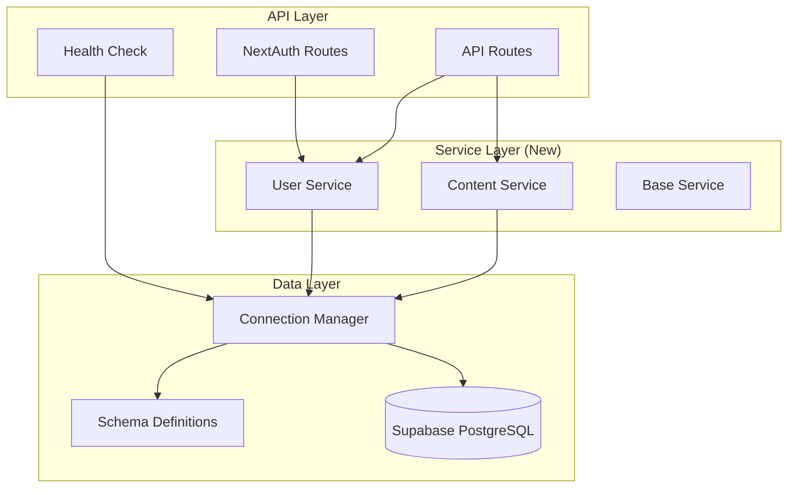

# NCLEX311 BMad - Drizzle ORM Brownfield Enhancement Architecture

## Architecture Decision Record: Database Layer Modernization

**Date:** 2025-09-27  
**Status:** Approved  
**Decision:** Adopt Drizzle ORM for database access layer  
**Architecture Type:** Brownfield Enhancement  

---

## Executive Summary

This document outlines the architectural approach for enhancing **NCLEX311 BMad** with **Drizzle ORM adoption for the data access layer**. This enhancement leverages the early development stage (only authentication implemented) to establish superior database access patterns while maintaining zero risk to existing functionality.

**Strategic Context:** With only Story 1.3 (Authentication) completed, we have a unique opportunity to modernize the data access layer before significant codebase expansion, providing long-term development velocity benefits at minimal migration cost.

---

## Current State Analysis

### Existing Infrastructure Foundation
- **Database:** PostgreSQL 16.x via Supabase (operational)
- **Current Client:** Supabase JS Client v2.57.x with 365+ lines of manual TypeScript interfaces
- **Authentication:** NextAuth v5 with bcrypt security (working)
- **Testing:** Jest + Playwright frameworks (operational)
- **CI/CD:** GitHub Actions + Vercel pipeline (operational)
- **Migration Strategy:** SQL files + Supabase Dashboard

### Pain Points Identified
1. **Manual Type Maintenance:** 365+ lines of hand-maintained interfaces in `database.ts`
2. **Schema-Type Drift Risk:** SQL migrations require separate TypeScript interface updates
3. **Verbose Query Patterns:** Repetitive Supabase client casting and query building
4. **Limited Type Safety:** Runtime database validation rather than compile-time

---

## Enhancement Architecture

### Technology Integration

| Component | Current | Enhanced | Integration Method |
|-----------|---------|----------|-------------------|
| Database Client | Supabase JS Client | Drizzle ORM | Gradual replacement |
| Type System | Manual interfaces | Schema-driven types | Generated from schema |
| Migration Strategy | SQL + Dashboard | Hybrid: SQL + Drizzle | Complementary approach |
| Query Building | Client methods | ORM query builder | Service layer abstraction |

### New Dependencies
- `drizzle-orm` (Latest) - Type-safe database queries
- `drizzle-kit` (Latest) - Schema management & migrations  
- `postgres` (Latest) - Direct PostgreSQL connection

### Schema-Driven Architecture

```typescript
// Enhanced approach: Schema as single source of truth
export const users = pgTable('users', {
  id: uuid('id').defaultRandom().primaryKey(),
  email: varchar('email', { length: 255 }).unique().notNull(),
  passwordHash: varchar('password_hash', { length: 255 }).notNull(),
  subscription: subscriptionTier('subscription').default('FREE').notNull(),
  createdAt: timestamp('created_at').defaultNow().notNull(),
  updatedAt: timestamp('updated_at').defaultNow().notNull(),
});

// Auto-generated types
export type User = typeof users.$inferSelect;
export type NewUser = typeof users.$inferInsert;
```

---

## Component Architecture

### Service Layer Pattern



### Migration Strategy: Gradual Enhancement

1. **Phase 1:** Create ORM schema mirroring existing structure
2. **Phase 2:** Migrate authentication system with comprehensive testing
3. **Phase 3:** Update health checks and utilities
4. **Phase 4:** Remove legacy Supabase client code

### Local Development Environment Setup

#### Prerequisites
- Node.js 18+ installed
- Existing NCLEX311 project cloned and working
- Supabase credentials configured in `.env.local`

#### Step-by-Step Setup Instructions

1. **Install New Dependencies**
   ```bash
   # Navigate to web app directory
   cd apps/web
   
   # Install Drizzle ORM dependencies
   npm install drizzle-orm drizzle-kit postgres
   npm install -D @types/pg
   ```

2. **Configure Drizzle Kit**
   ```bash
   # Create drizzle.config.ts in apps/web/
   touch drizzle.config.ts
   ```
   
3. **Environment Variable Updates**
   ```bash
   # Add to .env.local (user responsibility)
   DATABASE_URL=postgresql://[supabase-connection-string]
   DRIZZLE_DB_URL=postgresql://[supabase-connection-string]
   ```

4. **Create Schema Directory Structure**
   ```bash
   # Create schema organization
   mkdir -p src/lib/db/schema
   mkdir -p src/lib/db/migrations
   ```

5. **Validate Setup**
   ```bash
   # Test Drizzle connection (after schema creation)
   npx drizzle-kit push:pg --config=drizzle.config.ts --dry-run
   ```

---

## Integration Guarantees

### Zero External Impact
- **API Contracts:** All endpoints return identical response formats
- **Database Schema:** No structural changes to existing tables
- **UI/UX:** No changes to user-facing functionality
- **Infrastructure:** Same Vercel + Supabase deployment architecture

### Enhanced Capabilities
- **Type Safety:** Compile-time query validation
- **Developer Experience:** Superior autocompletion and error detection
- **Maintainability:** Schema-driven development reduces manual maintenance
- **Performance:** Optimized query generation with potential improvements

---

## Risk Assessment & Mitigation

### Risk Matrix
| Risk | Probability | Impact | Mitigation |
|------|-------------|--------|------------|
| Migration Complexity | Low | Medium | Gradual migration + dual compatibility |
| Performance Regression | Very Low | Medium | Performance monitoring + validation |
| Team Learning Curve | Medium | Low | Service layer abstractions + documentation |

### Safety Measures
- **Dual Compatibility:** Both approaches working during transition
- **Comprehensive Testing:** Unit, integration, and E2E validation
- **Rollback Ready:** Git-level rollback with zero database changes
- **Production Monitoring:** Enhanced health checks for both connection methods

---

## Implementation Roadmap

### Technical Implementation Sequence

```mermaid
gantt
    title ORM Migration Implementation
    dateFormat X
    axisFormat %d
    
    section Setup
    Install Dependencies    :done, deps, 0, 1d
    Create Schema Defs     :done, schema, after deps, 1d
    
    section Migration
    Auth System Migration   :active, auth, after schema, 2d
    Testing & Validation   :testing, after auth, 1d
    Health Check Update    :health, after testing, 1d
    
    section Cleanup
    Legacy Code Removal    :cleanup, after health, 1d
    Documentation Update   :docs, after cleanup, 1d
```



### Acceptance Criteria
- [ ] All existing authentication functionality works identically
- [ ] Type safety improved with schema-driven types
- [ ] Service layer provides clean abstraction
- [ ] Performance maintained or improved
- [ ] Test suite passes with enhanced coverage
- [ ] Rollback procedure validated

---

## Responsibility Matrix: User vs. Agent Tasks

### User Responsibilities (Manual Tasks)

| Task | Rationale | Timing |
|------|-----------|--------|
| **Supabase Connection String Retrieval** | Requires Supabase dashboard access/credentials | Before development starts |
| **Environment Variable Configuration** | Sensitive credential management | Setup phase |
| **Code Review & Approval** | Human judgment for architecture changes | Throughout migration |
| **Production Deployment Authorization** | Business decision requiring human oversight | After testing complete |

### Developer Agent Responsibilities (Automated Tasks)

| Task | Agent Type | Implementation Details |
|------|------------|----------------------|
| **Dependency Installation** | Development Agent | `npm install drizzle-orm drizzle-kit postgres` |
| **Schema Definition Creation** | Development Agent | TypeScript schema files mirroring database |
| **Service Layer Implementation** | Development Agent | UserService, ContentService, BaseService classes |
| **Test Suite Updates** | Development Agent | Unit, integration, and E2E test modifications |
| **Code Migration** | Development Agent | Gradual replacement of Supabase client calls |
| **Performance Monitoring** | Development Agent | Enhanced health checks and logging |
| **Documentation Updates** | Development Agent | Code comments, README updates, API docs |

---

## Enhanced Dependency Compatibility Analysis

### New Dependencies Impact Assessment

| Dependency | Version | Compatibility Risk | Mitigation |
|------------|---------|-------------------|------------|
| `drizzle-orm` | ^0.29.0+ | **LOW** - No conflicts with existing stack | Well-established, TypeScript-first |
| `drizzle-kit` | ^0.20.0+ | **LOW** - Development/migration tool only | Used only for schema management |
| `postgres` | ^3.4.0+ | **MEDIUM** - Direct PostgreSQL driver | May conflict with Supabase client connection pooling |
| `@types/pg` | ^8.10.0+ | **LOW** - TypeScript definitions only | Development dependency |

### Existing Stack Compatibility

| Current Package | Version | Drizzle Integration | Action Required |
|-----------------|---------|-------------------|----------------|
| `@supabase/supabase-js` | 2.57.x | **COMPATIBLE** - Gradual replacement | Maintain during transition |
| `next` | 14.x | **COMPATIBLE** - Framework agnostic | No changes needed |
| `typescript` | 5.x | **COMPATIBLE** - Enhanced type safety | No conflicts |
| `jest` | 29.x | **COMPATIBLE** - Enhanced testability | Service layer improves mocking |
| `playwright` | 1.x | **COMPATIBLE** - No E2E impact | Tests remain unchanged |

### Bundle Size Impact

- **Drizzle ORM:** ~45KB gzipped (lightweight)
- **Postgres Driver:** ~25KB gzipped
- **Net Impact:** +70KB total bundle size
- **Trade-off:** Acceptable for enhanced type safety and DX

---

## Team Handoff

### For Story Manager (Scrum Master)
Create implementation story: **"Database Layer Migration to Drizzle ORM"**

**Integration Checkpoints:**
1. Schema definitions match existing database exactly
2. Authentication routes produce identical responses
3. All tests pass with new implementation
4. Performance metrics maintained

### For Development Team
**Implementation Priorities:**
1. Follow established TypeScript and service patterns
2. Maintain existing API contracts exactly
3. Enhance test coverage through service layer mocking
4. Document ORM patterns for team consistency

**Validation Checkpoints:**
- [ ] **Checkpoint 1:** Schema definitions created and validated against existing database
- [ ] **Checkpoint 2:** Service layer abstraction implemented with proper interfaces  
- [ ] **Checkpoint 3:** Authentication migration complete with identical API responses
- [ ] **Checkpoint 4:** All existing tests pass with new implementation
- [ ] **Checkpoint 5:** Performance benchmarks meet or exceed baseline
- [ ] **Checkpoint 6:** Rollback procedure tested and documented

**Configuration Requirements:**
```typescript
// drizzle.config.ts template
import type { Config } from 'drizzle-kit';

export default {
  schema: './src/lib/db/schema/*',
  out: './src/lib/db/migrations',
  driver: 'pg',
  dbCredentials: {
    connectionString: process.env.DATABASE_URL!,
  },
} satisfies Config;
```

### Quality Assurance
**Validation Focus:**
- Authentication flows work identically
- API responses match existing formats
- Performance characteristics maintained
- Security posture preserved

---

## Architecture Decision Rationale

### Why Now?
- **Perfect Timing:** Only authentication implemented (minimal migration scope)
- **Early Development:** Future features benefit from day one
- **Risk Minimization:** Small codebase means lower complexity
- **Team Learning:** Gradual adoption without pressure

### Why Drizzle?
- **PostgreSQL Optimized:** Designed specifically for PostgreSQL
- **Lightweight:** Minimal overhead for serverless environments
- **TypeScript First:** Schema-driven type generation
- **Supabase Compatible:** Works seamlessly with existing infrastructure

### Strategic Benefits
- **Developer Velocity:** Enhanced productivity through better tooling
- **Code Quality:** Type safety reduces runtime errors
- **Maintainability:** Schema evolution becomes code-driven
- **Future Flexibility:** Easier feature development and database changes

---

## Conclusion

This brownfield enhancement represents a **strategic investment in development infrastructure** that:

✅ **Leverages optimal timing** - early development stage minimizes migration cost  
✅ **Maintains zero risk** - existing functionality preserved throughout transition  
✅ **Provides immediate benefits** - enhanced type safety and developer experience  
✅ **Establishes superior patterns** - foundation for accelerated future development  

**Recommendation:** Proceed with implementation following the gradual migration approach outlined in this architecture document.

---

*This architecture decision supports the project's rapid development goals by establishing superior technical patterns while maintaining the stability of existing working systems.*