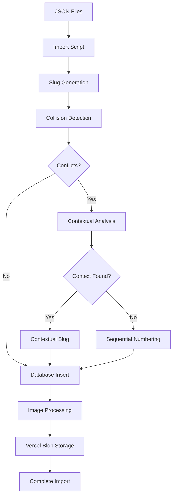

# Content Import System Architecture

## Overview

The content import system is responsible for processing pre-extracted NCLEX educational content from JSON files and importing it into the PostgreSQL database. The system handles complex data relationships, medical images, and implements sophisticated slug uniqueness strategies to prevent URL conflicts.

## System Components

### 1. Import Script Architecture

**Location**: `apps/web/scripts/import-content.ts`

**Key Components:**
- **ContentImporter**: Main orchestrator class
- **SmartSlugGenerator**: Handles slug uniqueness with collision resolution
- **ImageProcessor**: Manages Vercel Blob Storage integration
- **ValidationEngine**: Ensures data integrity throughout import

### 2. Data Flow Architecture



## Slug Uniqueness Strategy

### Problem Statement

During NCLEX content import, multiple concepts share identical titles both within and across chapters:
- **Same Chapter Collisions**: "Triage" appears 2× in "Management of Care"
- **Cross Chapter Collisions**: "Heart Failure" appears 2× in "Physiological Adaptation"
- **Complex Medical Terms**: "Guillain-Barre Syndrome" appears 2× in "Reduction of Risk Potential"

**Additionally, the system handles diverse question types:**
- **Multiple Choice**: Standard single-answer questions
- **Select All That Apply (SATA)**: Multiple correct answers  
- **Matrix Grid**: Complex categorization questions
- **Fill-in-the-Blank**: Text input questions
- **Prioritization**: Drag-and-drop sequencing questions requiring users to arrange items in correct order

**Prioritization Question Details:**
- **Format**: List of items to be arranged in correct sequence
- **Answer Format**: Comma-separated sequence (e.g., "2, 4, 3, 1")
- **Common Uses**: Developmental milestones, procedural steps, priority assessments
- **Example**: "Arrange motor development milestones in ascending order"

### Solution Architecture: Enhanced Sequential Numbering

#### Three-Tier Strategy

1. **Clean Base Slug** (Priority 1)
   - First occurrence gets clean, SEO-friendly slug
   - Examples: `triage`, `heart-failure`, `guillain-barre-syndrome`

2. **Contextual Differentiation** (Priority 2)
   - Extract meaningful context from `key_points` content
   - Medical specialties: `pediatric`, `adult`, `geriatric`, `neonatal`
   - Body systems: `cardiac`, `pulmonary`, `renal`, `hepatic`, `neurologic`
   - Severity modifiers: `acute`, `chronic`, `severe`, `mild`, `critical`
   - Treatment context: `medication`, `surgery`, `assessment`, `prevention`, `therapy`
   - Clinical conditions: `infection`, `inflammation`, `disease`, `disorder`
   - Chapter context: abbreviated chapter names as final contextual option

3. **Sequential Numbering** (Fallback)
   - Reliable fallback ensuring zero import failures
   - Pattern: `{base-slug}-{number}`
   - Examples: `triage-2`, `heart-failure-3`

#### Implementation Details

```typescript
interface ConceptContext {
  title: string;
  chapterTitle: string;
  bookPage: number;
  keyPoints: string;
  category: string;
}

class SmartSlugGenerator {
  private globalSlugs: Set<string> = new Set();
  private contextPatterns: RegExp[] = [
    /\b(pediatric|adult|geriatric|neonatal)\b/i,
    /\b(cardiac|pulmonary|renal|hepatic|neurologic)\b/i,
    /\b(acute|chronic|severe|mild|post-operative|pre-operative)\b/i,
    /\b(medication|surgery|therapy|assessment|prevention)\b/i,
  ];

  async generateUniqueConceptSlug(context: ConceptContext): Promise<string> {
    const baseSlug = this.generateBaseSlug(context.title);
    
    // Check database for existing conflicts
    const existingSlugs = await this.queryExistingSlugs(baseSlug);
    
    if (existingSlugs.length === 0) {
      return baseSlug; // Clean slug available
    }
    
    // Attempt contextual differentiation
    const contextualSlug = this.tryContextualDifferentiation(context, existingSlugs);
    if (contextualSlug) {
      return contextualSlug;
    }
    
    // Fall back to sequential numbering
    return this.generateSequentialSlug(baseSlug, existingSlugs);
  }
  
  private tryContextualDifferentiation(
    context: ConceptContext, 
    existing: string[]
  ): string | null {
    for (const pattern of this.contextPatterns) {
      const match = context.keyPoints.match(pattern);
      if (match) {
        const contextSlug = `${this.generateBaseSlug(context.title)}-${match[1].toLowerCase()}`;
        if (!existing.includes(contextSlug)) {
          return contextSlug;
        }
      }
    }
    
    // Try page context as final option
    const pageSlug = `${this.generateBaseSlug(context.title)}-page-${context.bookPage}`;
    if (!existing.includes(pageSlug)) {
      return pageSlug;
    }
    
    return null;
  }
}
```

## Database Integration

### Slug Conflict Detection

**Query Pattern:**
```sql
SELECT slug FROM concepts 
WHERE slug LIKE $1 
ORDER BY slug;
-- Example: WHERE slug LIKE 'triage%'
-- Returns: ['triage', 'triage-2', 'triage-emergency']
```

**Conflict Resolution Process:**
1. Generate base slug from concept title
2. Query database for all slugs matching pattern
3. Attempt contextual differentiation using content analysis
4. Fall back to finding next available sequential number
5. Insert with guaranteed unique slug

### Performance Optimizations

**Database Indexes:**
```sql
CREATE INDEX idx_concepts_slug ON concepts(slug);     -- Uniqueness checking
CREATE INDEX idx_concepts_title ON concepts(title);   -- Collision detection
CREATE INDEX idx_concepts_chapter_id ON concepts(chapter_id); -- Chapter queries
```

**In-Memory Caching:**
- Track generated slugs during import session
- Avoid redundant database queries for same base slug
- Batch conflict detection for performance

## Error Handling & Recovery

### Import Failure Scenarios

1. **Database Constraint Violations**
   - Automatic retry with next sequential slug
   - Never fail import due to slug conflicts

2. **Malformed JSON Data**
   - Skip invalid files with detailed logging
   - Continue processing remaining valid files

3. **Image Upload Failures**
   - Mark image as failed but continue concept import
   - Separate retry mechanism for image processing

### Rollback Strategy

**Safe Rollback Process:**
```typescript
class ImportRollback {
  async rollbackImport(importSessionId: string): Promise<void> {
    // 1. Delete concepts created in this session
    await this.deleteConceptsBySession(importSessionId);
    
    // 2. Delete orphaned images from Vercel Blob
    await this.cleanupOrphanedImages();
    
    // 3. Reset chapter creation if needed
    await this.rollbackChapterCreation(importSessionId);
  }
}
```

## URL Structure Impact

### Clean URL Examples

**First Occurrences (Clean URLs):**
- `/concepts/triage`
- `/concepts/heart-failure`  
- `/concepts/bacterial-meningitis`

**Contextual Differentiation:**
- `/concepts/triage-emergency`
- `/concepts/heart-failure-acute`
- `/concepts/bacterial-meningitis-pediatric`
- `/concepts/assessment-cardiac`
- `/concepts/pain-management-chronic`

**Sequential Fallback:**
- `/concepts/triage-2`
- `/concepts/heart-failure-2`
- `/concepts/bacterial-meningitis-2`

### SEO & User Experience Benefits

1. **Clean URLs for Primary Content**: Most important concepts get readable URLs
2. **Meaningful Context**: Contextual slugs provide semantic value
3. **Predictable Fallback**: Sequential numbering ensures reliability
4. **Global Uniqueness**: No URL conflicts across content expansion
5. **Future Proof**: Scales to unlimited content without architectural changes

## Testing Strategy

### Unit Tests

**Slug Generation Testing:**
```typescript
describe('SmartSlugGenerator', () => {
  it('should generate clean slug for unique titles', () => {
    const result = generator.generateUniqueSlug(uniqueContext);
    expect(result).toBe('unique-concept-title');
  });
  
  it('should use contextual differentiation for collisions', () => {
    const result = generator.generateUniqueSlug(contextWithKeywords);
    expect(result).toBe('duplicate-title-acute');
  });
  
  it('should fall back to sequential numbering', () => {
    const result = generator.generateUniqueSlug(duplicateWithoutContext);
    expect(result).toBe('duplicate-title-2');
  });
});
```

### Integration Tests

**Database Constraint Testing:**
- Verify uniqueness constraints prevent violations
- Test rollback scenarios with partial failures
- Validate performance under high collision scenarios

### Performance Testing

**Slug Generation Benchmarks:**
- Target: < 50ms per slug generation including database queries
- Batch processing: Handle 1000+ concepts efficiently
- Memory usage: Reasonable caching without memory leaks

## Monitoring & Observability

### Import Metrics

**Key Performance Indicators:**
- Import success rate (target: 99%+)
- Slug collision rate (tracking for optimization)
- Contextual differentiation success rate
- Average import time per concept

**Logging Strategy:**
```typescript
interface ImportLog {
  conceptTitle: string;
  generatedSlug: string;
  strategy: 'clean' | 'contextual' | 'sequential';
  processingTime: number;
  collisionCount: number;
}
```

### Error Tracking

**Critical Alerts:**
- High collision rates indicating content pattern changes
- Database constraint violations (should never occur)
- Image processing failures above threshold

## Future Enhancements

### Phase 2: Machine Learning Context

**Advanced Context Extraction:**
- NLP-based content analysis for better context extraction
- Medical terminology recognition for more meaningful differentiators
- Automated synonym detection for improved contextual slugs

### Phase 3: User-Friendly URLs

**Semantic URL Enhancement:**
- Medical specialty-based URL prefixing: `/cardiology/heart-failure`
- Chapter-contextual routing: `/management-of-care/triage`
- Intelligent redirects from old to new URL structures

This architecture ensures reliable content import while maintaining clean, SEO-friendly URLs and providing a foundation for future content management enhancements.