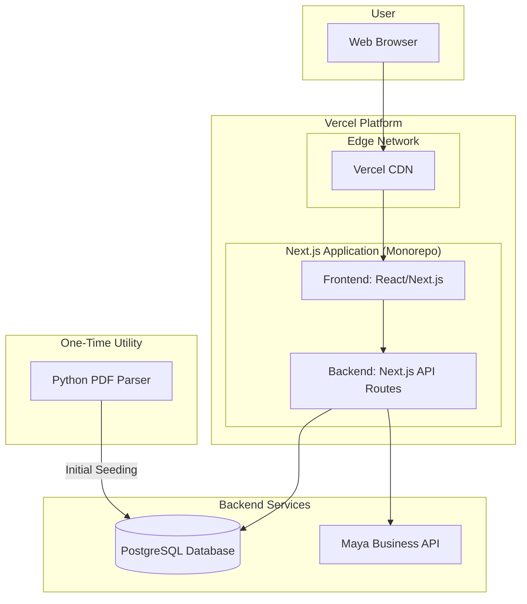

# High Level Architecture

## Technical Summary

The architecture for NCLEX311-Web is an integrated, serverless-first design centered on the **Next.js** framework. This approach unifies the frontend and backend into a single codebase, simplifying development and aligning with the rapid 4-month launch target. The application will be deployed on **Vercel**, a platform optimized for Next.js, to leverage its global edge network for performance and scalability. Backend logic, including user authentication, payment processing, and data access, will be handled via **Next.js API Routes**, which will interact with a **PostgreSQL** database. This streamlined stack ensures a cohesive development experience and provides a robust foundation to meet the functional and non-functional requirements outlined in the PRD.

## Platform and Infrastructure Choice

**Platform:** Vercel
**Key Services:** Vercel Hosting, Vercel Postgres, Vercel Edge Functions
**Deployment Host and Regions:** Vercel's Global Edge Network

## Repository Structure

**Structure:** Monorepo
**Monorepo Tool:** npm Workspaces (simple and effective for this scale)
**Package Organization:** An `apps` directory for the main web application and a `packages` directory for shared code (e.g., types, UI components).

## High Level Architecture Diagram

## Architectural Patterns

- **Integrated Architecture (Next.js):** The frontend and backend are built within the same Next.js application.
  - _Rationale:_ Simplifies development, deployment, and state management, accelerating the development lifecycle as required by the project goals.
- **Serverless:** API routes are deployed as serverless functions.
  - _Rationale:_ Automatic scaling to handle fluctuating user loads (up to 1,000 concurrent users) and cost-efficiency, as we only pay for what we use.
- **Component-Based UI:** The frontend will be built as a collection of reusable React components.
  - _Rationale:_ Enhances maintainability, testability, and development speed.
- **API Routes:** Backend logic is exposed via Next.js API Routes.
  - _Rationale:_ Provides a file-based routing system for building the API, keeping the frontend and backend tightly integrated.

## Testing & CI/CD Alignment

This project adopts a test-first, automation-friendly setup to ensure quality and speed:

- Testing Frameworks
  - Frontend: Jest + React Testing Library (unit/component)
  - Backend: Jest + Supertest (API routes)
  - E2E: Playwright (cross-browser flows)
- CI/CD Baseline
  - Deployments: Vercel (preview on PRs, staging on main)
  - GitHub Actions: run lint, unit/API tests, and basic E2E smoke on PRs and main
- Environment Strategy
  - Use .env.local for local development; provide .env.example committed to the repo
  - Never commit secrets; configure production/staging env vars via Vercel
