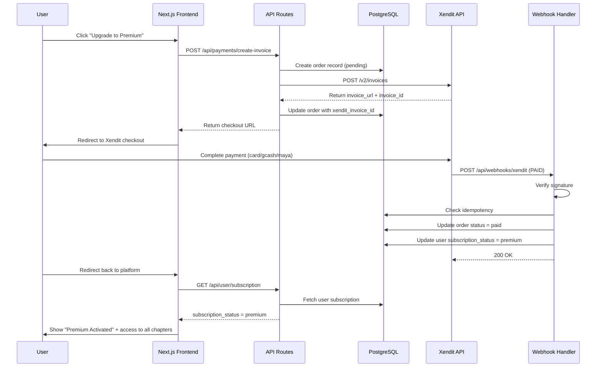
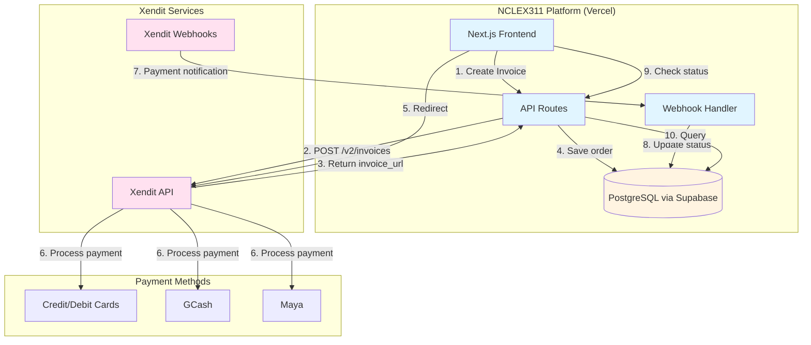

# Xendit Payment Integration Architecture

**Document Version:** 1.0  
**Last Updated:** October 2025  
**Author:** Winston (Architect)  
**Status:** Approved for Implementation

---

## Table of Contents

1. [Executive Summary](#executive-summary)
2. [Integration Overview](#integration-overview)
3. [System Architecture](#system-architecture)
4. [Technical Design](#technical-design)
5. [Database Schema](#database-schema)
6. [API Specifications](#api-specifications)
7. [Security Implementation](#security-implementation)
8. [Testing Strategy](#testing-strategy)
9. [Deployment & Configuration](#deployment--configuration)
10. [Monitoring & Observability](#monitoring--observability)
11. [Implementation Roadmap](#implementation-roadmap)

---

## Executive Summary

### Purpose

This document defines the technical architecture for integrating Xendit payment gateway into the NCLEX311-Web platform to enable premium subscription payments. This integration replaces the previously planned Maya Business gateway integration referenced in Epic 2.

### Key Decisions

| Decision Area | Choice | Rationale |
|---------------|--------|-----------|
| **Integration Pattern** | Server-side REST API + Hosted Checkout | Maximum security, PCI-DSS compliant, fastest MVP path |
| **Payment Methods (MVP)** | Credit/Debit Cards, GCash, Maya | Covers 95%+ of Philippine target users |
| **Payment Model** | One-time annual payment | Aligned with PRD requirements |
| **Webhook Strategy** | Async processing with idempotency | Reliable payment confirmation under load |
| **Data Storage** | PostgreSQL via Drizzle ORM | Consistent with existing tech stack |
| **Error Handling** | Graceful degradation + fallback polling | Handles webhook delays/failures |

### Success Criteria

- ✅ Payment success rate >95%
- ✅ Webhook processing <5 seconds
- ✅ Zero stored card data (PCI-DSS compliant)
- ✅ Seamless integration with existing Next.js codebase
- ✅ Support for 1,000+ concurrent users

---

## Integration Overview

### High-Level Flow



### Integration Points



---

## System Architecture

### Component Architecture

```
┌─────────────────────────────────────────────────────────────────┐
│                        Next.js Application                       │
├─────────────────────────────────────────────────────────────────┤
│  Frontend Layer (React Components)                               │
│  ┌──────────────────┐  ┌──────────────────┐  ┌───────────────┐ │
│  │ PremiumGate      │  │ CheckoutButton   │  │ PaymentStatus │ │
│  │ Component        │  │ Component        │  │ Page          │ │
│  └──────────────────┘  └──────────────────┘  └───────────────┘ │
├─────────────────────────────────────────────────────────────────┤
│  API Layer (Next.js API Routes)                                  │
│  ┌────────────────────────────────────────────────────────────┐ │
│  │ Payment Service Layer                                       │ │
│  │  - POST /api/payments/create-invoice                       │ │
│  │  - GET  /api/payments/[orderId]/status                     │ │
│  │  - POST /api/payments/[invoiceId]/refund                   │ │
│  │                                                              │ │
│  │ Webhook Handler                                             │ │
│  │  - POST /api/webhooks/xendit                               │ │
│  │                                                              │ │
│  │ User Subscription Service                                   │ │
│  │  - GET /api/user/subscription                              │ │
│  └────────────────────────────────────────────────────────────┘ │
├─────────────────────────────────────────────────────────────────┤
│  Business Logic Layer                                            │
│  ┌────────────────────────────────────────────────────────────┐ │
│  │ Xendit Client (lib/xendit.ts)                              │ │
│  │  - createInvoice()                                          │ │
│  │  - checkInvoiceStatus()                                     │ │
│  │  - createRefund()                                           │ │
│  │                                                              │ │
│  │ Webhook Verifier (lib/webhookVerification.ts)              │ │
│  │  - verifySignature()                                        │ │
│  │  - checkIdempotency()                                       │ │
│  │                                                              │ │
│  │ Subscription Manager (lib/subscriptionManager.ts)          │ │
│  │  - activatePremium()                                        │ │
│  │  - checkSubscriptionStatus()                                │ │
│  └────────────────────────────────────────────────────────────┘ │
├─────────────────────────────────────────────────────────────────┤
│  Data Access Layer (Drizzle ORM)                                 │
│  ┌────────────────────────────────────────────────────────────┐ │
│  │ Database Services                                           │ │
│  │  - orderService.ts                                          │ │
│  │  - webhookLogService.ts                                     │ │
│  │  - userService.ts                                           │ │
│  └────────────────────────────────────────────────────────────┘ │
└─────────────────────────────────────────────────────────────────┘
                              ↓
┌─────────────────────────────────────────────────────────────────┐
│              PostgreSQL Database (Supabase)                      │
│  ┌──────────┐  ┌──────────────┐  ┌────────────┐  ┌──────────┐ │
│  │  users   │  │   orders     │  │  payments  │  │ webhook  │ │
│  │  table   │  │   table      │  │   table    │  │  _logs   │ │
│  └──────────┘  └──────────────┘  └────────────┘  └──────────┘ │
└─────────────────────────────────────────────────────────────────┘
                              ↓
┌─────────────────────────────────────────────────────────────────┐
│                      Xendit Platform                             │
│  ┌────────────────┐  ┌──────────────┐  ┌───────────────────┐  │
│  │  Invoice API   │  │  Webhooks    │  │  Payment Methods  │  │
│  └────────────────┘  └──────────────┘  └───────────────────┘  │
└─────────────────────────────────────────────────────────────────┘
```

### Technology Stack Integration

| Layer | Technology | Usage |
|-------|------------|-------|
| **Frontend** | Next.js 15.5.x + TypeScript | Premium upgrade UI, checkout flow |
| **Backend** | Next.js API Routes | Payment API endpoints, webhook handler |
| **Database** | PostgreSQL (Supabase) + Drizzle ORM | Orders, payments, webhook logs, user subscriptions |
| **Authentication** | Auth.js (NextAuth) | User session management for payments |
| **Payment Gateway** | Xendit REST API | Payment processing, invoice management |
| **Deployment** | Vercel | Serverless functions, edge network |
| **Monitoring** | Vercel Analytics + Custom logging | Transaction monitoring, error tracking |

---

## Technical Design

### 1. Payment Initialization Flow

**File:** `app/api/payments/create-invoice/route.ts`

```typescript
// POST /api/payments/create-invoice
import { NextRequest, NextResponse } from 'next/server';
import { getServerSession } from 'next-auth';
import { authOptions } from '@/lib/auth';
import { createXenditInvoice } from '@/lib/xendit';
import { orderService } from '@/services/orderService';
import { v4 as uuidv4 } from 'uuid';

export async function POST(request: NextRequest) {
  try {
    // 1. Authenticate user
    const session = await getServerSession(authOptions);
    if (!session?.user?.id) {
      return NextResponse.json(
        { error: 'Unauthorized' },
        { status: 401 }
      );
    }

    // 2. Parse request
    const { planType } = await request.json();
    
    // 3. Validate plan (currently only annual premium)
    if (planType !== 'annual_premium') {
      return NextResponse.json(
        { error: 'Invalid plan type' },
        { status: 400 }
      );
    }

    // 4. Check if user already has active subscription
    const user = await userService.findById(session.user.id);
    if (user.subscription_status === 'premium' && 
        user.subscription_expires_at > new Date()) {
      return NextResponse.json(
        { error: 'Active subscription already exists' },
        { status: 400 }
      );
    }

    // 5. Create order in database
    const orderId = `order_${uuidv4()}`;
    const amount = 199900; // ₱1,999.00 in centavos
    
    await orderService.create({
      orderId,
      userId: session.user.id,
      amount,
      currency: 'PHP',
      status: 'pending',
      planType: 'annual_premium',
    });

    // 6. Create Xendit invoice
    const invoice = await createXenditInvoice({
      external_id: orderId,
      amount,
      description: 'NCLEX311 Premium Annual Subscription',
      customer: {
        given_names: user.name || 'User',
        email: user.email,
        mobile_number: user.phone,
      },
      invoice_duration: 86400, // 24 hours
      success_redirect_url: `${process.env.NEXTAUTH_URL}/payment/success?order=${orderId}`,
      failure_redirect_url: `${process.env.NEXTAUTH_URL}/payment/failed?order=${orderId}`,
    });

    if (!invoice.success) {
      await orderService.update(orderId, { status: 'failed' });
      return NextResponse.json(
        { error: invoice.error },
        { status: 500 }
      );
    }

    // 7. Update order with Xendit details
    await orderService.update(orderId, {
      xenditInvoiceId: invoice.invoiceId,
      xenditInvoiceUrl: invoice.invoiceUrl,
      expiresAt: invoice.expiryDate,
    });

    // 8. Return checkout URL to frontend
    return NextResponse.json({
      success: true,
      orderId,
      checkoutUrl: invoice.invoiceUrl,
      expiresAt: invoice.expiryDate,
    });

  } catch (error) {
    console.error('Payment initialization error:', error);
    return NextResponse.json(
      { error: 'Payment initialization failed' },
      { status: 500 }
    );
  }
}
```

### 2. Xendit Client Implementation

**File:** `lib/xendit.ts`

```typescript
import axios, { AxiosInstance } from 'axios';

interface XenditConfig {
  secretKey: string;
  baseURL: string;
}

interface CreateInvoiceParams {
  external_id: string;
  amount: number;
  description: string;
  customer: {
    given_names: string;
    email: string;
    mobile_number?: string;
  };
  invoice_duration: number;
  success_redirect_url: string;
  failure_redirect_url: string;
}

class XenditClient {
  private client: AxiosInstance;

  constructor(config: XenditConfig) {
    this.client = axios.create({
      baseURL: config.baseURL,
      auth: {
        username: config.secretKey,
        password: '', // Xendit uses API key as username
      },
      headers: {
        'Content-Type': 'application/json',
      },
    });
  }

  async createInvoice(params: CreateInvoiceParams) {
    try {
      const response = await this.client.post('/v2/invoices', {
        external_id: params.external_id,
        amount: params.amount,
        description: params.description,
        invoice_duration: params.invoice_duration,
        currency: 'PHP',
        customer: params.customer,
        customer_notification_preference: {
          invoice_created: ['email'],
          invoice_paid: ['email'],
        },
        success_redirect_url: params.success_redirect_url,
        failure_redirect_url: params.failure_redirect_url,
        items: [{
          name: 'NCLEX311 Premium Annual',
          quantity: 1,
          price: params.amount,
          category: 'Educational Content',
        }],
      });

      return {
        success: true,
        invoiceId: response.data.id,
        invoiceUrl: response.data.invoice_url,
        expiryDate: response.data.expiry_date,
      };
    } catch (error: any) {
      console.error('Xendit invoice creation failed:', error.response?.data);
      return {
        success: false,
        error: error.response?.data?.message || 'Invoice creation failed',
      };
    }
  }

  async checkInvoiceStatus(invoiceId: string) {
    try {
      const response = await this.client.get(`/v2/invoices/${invoiceId}`);
      return {
        success: true,
        status: response.data.status,
        paidAmount: response.data.paid_amount,
        paidAt: response.data.paid_at,
        paymentMethod: response.data.payment_method,
      };
    } catch (error: any) {
      console.error('Status check failed:', error.response?.data);
      return {
        success: false,
        error: 'Status check failed',
      };
    }
  }
}

// Export singleton instance
export const xenditClient = new XenditClient({
  secretKey: process.env.XENDIT_SECRET_KEY!,
  baseURL: 'https://api.xendit.co',
});

export const createXenditInvoice = (params: CreateInvoiceParams) =>
  xenditClient.createInvoice(params);

export const checkXenditInvoiceStatus = (invoiceId: string) =>
  xenditClient.checkInvoiceStatus(invoiceId);
```

### 3. Webhook Handler

**File:** `app/api/webhooks/xendit/route.ts`

```typescript
import { NextRequest, NextResponse } from 'next/server';
import { verifyWebhookSignature } from '@/lib/webhookVerification';
import { webhookLogService } from '@/services/webhookLogService';
import { orderService } from '@/services/orderService';
import { userService } from '@/services/userService';
import { sendPremiumConfirmationEmail } from '@/lib/email';

export async function POST(request: NextRequest) {
  try {
    // 1. Extract webhook data
    const callbackToken = request.headers.get('x-callback-token');
    const signature = request.headers.get('x-signature');
    const body = await request.json();

    // 2. Verify webhook signature
    if (!verifyWebhookSignature(callbackToken, body, signature)) {
      console.error('Invalid webhook signature');
      return NextResponse.json(
        { error: 'Invalid signature' },
        { status: 401 }
      );
    }

    // 3. Check idempotency (prevent duplicate processing)
    const webhookId = body.id;
    const existingLog = await webhookLogService.findByWebhookId(webhookId);
    
    if (existingLog?.processed) {
      console.log('Duplicate webhook ignored:', webhookId);
      return NextResponse.json({ status: 'duplicate' }, { status: 200 });
    }

    // 4. Log webhook for idempotency
    await webhookLogService.create({
      webhookId,
      eventType: 'invoice.paid',
      payload: body,
      processed: false,
    });

    // 5. Process based on invoice status
    const { external_id, status, paid_amount, payment_method, paid_at } = body;

    switch (status) {
      case 'PAID':
        await handlePaidInvoice(external_id, {
          paidAmount: paid_amount,
          paymentMethod: payment_method,
          paidAt: paid_at,
          xenditInvoiceId: body.id,
        });
        break;

      case 'EXPIRED':
        await orderService.update(external_id, { status: 'expired' });
        break;

      case 'FAILED':
        await orderService.update(external_id, { 
          status: 'failed',
          failureCode: body.failure_code,
        });
        break;

      default:
        console.log('Unhandled invoice status:', status);
    }

    // 6. Mark webhook as processed
    await webhookLogService.update(webhookId, { processed: true });

    return NextResponse.json({ status: 'received' }, { status: 200 });

  } catch (error) {
    console.error('Webhook processing error:', error);
    // Return 500 so Xendit retries
    return NextResponse.json(
      { error: 'Processing failed' },
      { status: 500 }
    );
  }
}

async function handlePaidInvoice(
  orderId: string,
  paymentData: {
    paidAmount: number;
    paymentMethod: string;
    paidAt: string;
    xenditInvoiceId: string;
  }
) {
  // 1. Update order status
  const order = await orderService.update(orderId, {
    status: 'paid',
    paidAmount: paymentData.paidAmount,
    paymentMethod: paymentData.paymentMethod,
    paidAt: new Date(paymentData.paidAt),
  });

  // 2. Activate premium subscription (1 year from payment date)
  const expiresAt = new Date(paymentData.paidAt);
  expiresAt.setFullYear(expiresAt.getFullYear() + 1);

  await userService.update(order.userId, {
    subscription_status: 'premium',
    subscription_expires_at: expiresAt,
  });

  // 3. Send confirmation email
  await sendPremiumConfirmationEmail(order.userId, {
    amount: paymentData.paidAmount,
    expiresAt,
  });

  console.log(`Order ${orderId} paid successfully - Premium activated`);
}
```

### 4. Webhook Signature Verification

**File:** `lib/webhookVerification.ts`

```typescript
import crypto from 'crypto';

export function verifyWebhookSignature(
  callbackToken: string | null,
  body: any,
  signature: string | null
): boolean {
  if (!callbackToken || !signature) {
    console.error('Missing callback token or signature');
    return false;
  }

  try {
    const webhookToken = process.env.XENDIT_WEBHOOK_TOKEN!;
    
    const expectedSignature = crypto
      .createHmac('sha256', webhookToken)
      .update(JSON.stringify(body))
      .digest('hex');

    return crypto.timingSafeEqual(
      Buffer.from(signature),
      Buffer.from(expectedSignature)
    );
  } catch (error) {
    console.error('Signature verification error:', error);
    return false;
  }
}
```

---

## Database Schema

### Schema Additions (Drizzle ORM)

**File:** `db/schema/payments.ts`

```typescript
import { pgTable, uuid, varchar, integer, timestamp, boolean, jsonb } from 'drizzle-orm/pg-core';
import { users } from './users';

// Orders table
export const orders = pgTable('orders', {
  id: uuid('id').defaultRandom().primaryKey(),
  orderId: varchar('order_id', { length: 255 }).unique().notNull(),
  userId: uuid('user_id').references(() => users.id).notNull(),
  amount: integer('amount').notNull(), // In centavos
  currency: varchar('currency', { length: 3 }).default('PHP').notNull(),
  status: varchar('status', { length: 50 }).notNull(), // pending, paid, expired, failed, refunded
  planType: varchar('plan_type', { length: 50 }).notNull(), // annual_premium
  xenditInvoiceId: varchar('xendit_invoice_id', { length: 255 }),
  xenditInvoiceUrl: varchar('xendit_invoice_url', { length: 500 }),
  paymentMethod: varchar('payment_method', { length: 100 }),
  paidAmount: integer('paid_amount'),
  paidAt: timestamp('paid_at'),
  expiresAt: timestamp('expires_at'),
  failureCode: varchar('failure_code', { length: 100 }),
  createdAt: timestamp('created_at').defaultNow().notNull(),
  updatedAt: timestamp('updated_at').defaultNow().notNull(),
});

// Webhook logs table (for idempotency)
export const webhookLogs = pgTable('webhook_logs', {
  id: uuid('id').defaultRandom().primaryKey(),
  webhookId: varchar('webhook_id', { length: 255 }).unique().notNull(),
  eventType: varchar('event_type', { length: 100 }).notNull(),
  payload: jsonb('payload').notNull(),
  processed: boolean('processed').default(false).notNull(),
  processedAt: timestamp('processed_at'),
  createdAt: timestamp('created_at').defaultNow().notNull(),
});
```

### Users Table Updates

**File:** `db/schema/users.ts` (additions)

```typescript
// Add to existing users table
export const users = pgTable('users', {
  // ... existing fields ...
  
  // Subscription fields
  subscription_status: varchar('subscription_status', { length: 50 })
    .default('free')
    .notNull(), // 'free', 'premium', 'expired'
  subscription_expires_at: timestamp('subscription_expires_at'),
  subscription_started_at: timestamp('subscription_started_at'),
});
```

### Migration Script

**File:** `db/migrations/0005_add_payment_tables.sql`

```sql
-- Create orders table
CREATE TABLE orders (
  id UUID PRIMARY KEY DEFAULT uuid_generate_v4(),
  order_id VARCHAR(255) UNIQUE NOT NULL,
  user_id UUID NOT NULL REFERENCES users(id),
  amount INTEGER NOT NULL,
  currency VARCHAR(3) DEFAULT 'PHP' NOT NULL,
  status VARCHAR(50) NOT NULL,
  plan_type VARCHAR(50) NOT NULL,
  xendit_invoice_id VARCHAR(255),
  xendit_invoice_url VARCHAR(500),
  payment_method VARCHAR(100),
  paid_amount INTEGER,
  paid_at TIMESTAMP,
  expires_at TIMESTAMP,
  failure_code VARCHAR(100),
  created_at TIMESTAMP DEFAULT CURRENT_TIMESTAMP NOT NULL,
  updated_at TIMESTAMP DEFAULT CURRENT_TIMESTAMP NOT NULL
);

-- Create webhook_logs table
CREATE TABLE webhook_logs (
  id UUID PRIMARY KEY DEFAULT uuid_generate_v4(),
  webhook_id VARCHAR(255) UNIQUE NOT NULL,
  event_type VARCHAR(100) NOT NULL,
  payload JSONB NOT NULL,
  processed BOOLEAN DEFAULT FALSE NOT NULL,
  processed_at TIMESTAMP,
  created_at TIMESTAMP DEFAULT CURRENT_TIMESTAMP NOT NULL
);

-- Add subscription fields to users table
ALTER TABLE users ADD COLUMN subscription_status VARCHAR(50) DEFAULT 'free' NOT NULL;
ALTER TABLE users ADD COLUMN subscription_expires_at TIMESTAMP;
ALTER TABLE users ADD COLUMN subscription_started_at TIMESTAMP;

-- Create indexes
CREATE INDEX idx_orders_user_id ON orders(user_id);
CREATE INDEX idx_orders_order_id ON orders(order_id);
CREATE INDEX idx_orders_status ON orders(status);
CREATE INDEX idx_orders_xendit_invoice_id ON orders(xendit_invoice_id);
CREATE INDEX idx_webhook_logs_webhook_id ON webhook_logs(webhook_id);
CREATE INDEX idx_webhook_logs_processed ON webhook_logs(processed);
CREATE INDEX idx_users_subscription_status ON users(subscription_status);
```

---

## API Specifications

### API Endpoints

| Method | Endpoint | Purpose | Auth Required |
|--------|----------|---------|---------------|
| POST | `/api/payments/create-invoice` | Initialize payment and get checkout URL | Yes |
| GET | `/api/payments/[orderId]/status` | Check order payment status | Yes |
| POST | `/api/webhooks/xendit` | Receive payment notifications from Xendit | No (signature verified) |
| GET | `/api/user/subscription` | Get user's subscription details | Yes |
| POST | `/api/payments/[invoiceId]/refund` | Create refund (admin only) | Yes (admin) |

### Request/Response Schemas

#### POST /api/payments/create-invoice

**Request:**
```json
{
  "planType": "annual_premium"
}
```

**Response (Success):**
```json
{
  "success": true,
  "orderId": "order_uuid",
  "checkoutUrl": "https://checkout.xendit.co/web/...",
  "expiresAt": "2025-10-21T03:43:00Z"
}
```

**Response (Error):**
```json
{
  "error": "Active subscription already exists"
}
```

#### GET /api/payments/[orderId]/status

**Response:**
```json
{
  "orderId": "order_uuid",
  "status": "paid",
  "amount": 199900,
  "paymentMethod": "GCASH",
  "paidAt": "2025-10-20T10:30:00Z"
}
```

#### POST /api/webhooks/xendit

**Request (from Xendit):**
```json
{
  "id": "xendit_invoice_id",
  "external_id": "order_uuid",
  "status": "PAID",
  "paid_amount": 199900,
  "payment_method": "GCASH",
  "paid_at": "2025-10-20T10:30:00Z",
  "user_id": "xendit_user_id",
  "currency": "PHP"
}
```

**Response:**
```json
{
  "status": "received"
}
```

---

## Security Implementation

### 1. API Key Management

```typescript
// Environment Variables (.env.local - never commit!)
XENDIT_SECRET_KEY=xnd_production_xxxxx
XENDIT_WEBHOOK_TOKEN=xxxxx
NEXTAUTH_URL=https://nclex311.com
```

**Security Measures:**
- Store in environment variables
- Never commit to version control
- Use Vercel environment variables for production
- Rotate keys quarterly
- Separate keys for test/production

### 2. Webhook Security

**Signature Verification:**
```typescript
// Always verify signature before processing
const isValid = verifyWebhookSignature(
  request.headers.get('x-callback-token'),
  body,
  request.headers.get('x-signature')
);

if (!isValid) {
  return NextResponse.json({ error: 'Invalid signature' }, { status: 401 });
}
```

**HTTPS Enforcement:**
- All webhook endpoints must use HTTPS
- Configured automatically on Vercel

**Rate Limiting:**
```typescript
// Add rate limiting middleware
import { Ratelimit } from '@upstash/ratelimit';

const ratelimit = new Ratelimit({
  redis: Redis.fromEnv(),
  limiter: Ratelimit.slidingWindow(10, '10 s'),
});

// In webhook handler
const { success } = await ratelimit.limit(request.ip);
if (!success) {
  return NextResponse.json({ error: 'Rate limit exceeded' }, { status: 429 });
}
```

### 3. PCI-DSS Compliance

**Critical Rules:**
- ❌ Never accept card data directly
- ❌ Never store card numbers, CVV, or PIN
- ❌ Never log full card numbers
- ✅ Always use Xendit hosted checkout
- ✅ Only store Xendit invoice IDs and payment metadata

**SAQ-A Compliance:**
- Use Xendit's hosted payment pages
- No card data touches our servers
- Minimal compliance scope (SAQ-A)

### 4. Authentication & Authorization

```typescript
// All payment endpoints require authentication
const session = await getServerSession(authOptions);
if (!session?.user?.id) {
  return NextResponse.json({ error: 'Unauthorized' }, { status: 401 });
}

// Check if user owns the order
const order = await orderService.findById(orderId);
if (order.userId !== session.user.id) {
  return NextResponse.json({ error: 'Forbidden' }, { status: 403 });
}
```

---

## Testing Strategy

### 1. Unit Tests

**Test Coverage:**
- Xendit client methods
- Webhook signature verification
- Order service CRUD operations
- Subscription activation logic

**Example Test:**
```typescript
// __tests__/lib/webhookVerification.test.ts
import { verifyWebhookSignature } from '@/lib/webhookVerification';

describe('verifyWebhookSignature', () => {
  it('should verify valid signature', () => {
    const body = { id: 'test', status: 'PAID' };
    const signature = computeTestSignature(body);
    
    const result = verifyWebhookSignature('token', body, signature);
    
    expect(result).toBe(true);
  });

  it('should reject invalid signature', () => {
    const body = { id: 'test', status: 'PAID' };
    
    const result = verifyWebhookSignature('token', body, 'invalid_signature');
    
    expect(result).toBe(false);
  });
});
```

### 2. Integration Tests

**Test Scenarios:**
- Invoice creation flow
- Successful payment webhook processing
- Failed payment webhook handling
- Idempotency (duplicate webhooks)
- Order status check

**Example Test:**
```typescript
// __tests__/api/payments/create-invoice.test.ts
import { POST } from '@/app/api/payments/create-invoice/route';

describe('POST /api/payments/create-invoice', () => {
  it('should create invoice for authenticated user', async () => {
    const request = createMockRequest({
      method: 'POST',
      body: { planType: 'annual_premium' },
      session: { user: { id: 'user_123' } },
    });

    const response = await POST(request);
    const data = await response.json();

    expect(response.status).toBe(200);
    expect(data.success).toBe(true);
    expect(data.checkoutUrl).toContain('xendit.co');
  });
});
```

### 3. Sandbox Testing Checklist

**Xendit Sandbox:**
- [ ] Create invoice successfully
- [ ] Test all payment methods (cards, GCash, Maya)
- [ ] Verify successful payment webhook
- [ ] Verify failed payment webhook
- [ ] Verify expired invoice webhook
- [ ] Test webhook signature verification
- [ ] Test duplicate webhook handling
- [ ] Test payment status polling (fallback)

**Test Cards:**
```
Success: 4000000000000002
Failed: 4000000000000010
3DS Challenge: 4000000000000028
CVV: any 3 digits
Expiry: any future date
```

### 4. E2E Tests (Playwright)

```typescript
// e2e/payment-flow.spec.ts
import { test, expect } from '@playwright/test';

test('Premium upgrade flow', async ({ page }) => {
  // 1. Login
  await page.goto('/login');
  await page.fill('[name="email"]', 'test@example.com');
  await page.fill('[name="password"]', 'password');
  await page.click('button[type="submit"]');

  // 2. Navigate to premium content
  await page.goto('/chapters/5');
  await expect(page.locator('text=Upgrade to Premium')).toBeVisible();

  // 3. Click upgrade
  await page.click('text=Upgrade to Premium');
  
  // 4. Should redirect to checkout (sandbox)
  await expect(page).toHaveURL(/checkout\.xendit\.co/);
  
  // Note: Actual payment testing done in sandbox with test cards
});
```

---

## Deployment & Configuration

### Environment Variables

**Required Variables:**
```bash
# Xendit API Keys
XENDIT_SECRET_KEY=xnd_production_xxxxx
XENDIT_WEBHOOK_TOKEN=xxxxx

# Application URLs
NEXTAUTH_URL=https://nclex311.com
NEXT_PUBLIC_APP_URL=https://nclex311.com

# Database (already configured)
DATABASE_URL=postgresql://...

# Email Service (for confirmations)
EMAIL_FROM=noreply@nclex311.com
SENDGRID_API_KEY=xxxxx
```

**Vercel Configuration:**

1. Navigate to Vercel Dashboard → Project → Settings → Environment Variables
2. Add production variables:
   - `XENDIT_SECRET_KEY` (production key)
   - `XENDIT_WEBHOOK_TOKEN` (production token)
3. Add preview/development variables with test keys

### Webhook Configuration

**Xendit Dashboard Setup:**

1. Login to https://dashboard.xendit.co
2. Navigate to Settings → Webhooks
3. Add webhook URL:
   - **Production:** `https://nclex311.com/api/webhooks/xendit`
   - **Preview:** `https://preview.nclex311.com/api/webhooks/xendit`
4. Select events: `invoice.paid`, `invoice.expired`, `invoice.payment.failed`
5. Save webhook token to environment variables

### Deployment Checklist

**Pre-Deployment:**
- [ ] Business documents submitted to Xendit
- [ ] Production account approved
- [ ] Bank account verified with Xendit
- [ ] Production API keys generated
- [ ] Webhook URL configured in Xendit
- [ ] Environment variables set in Vercel
- [ ] Database migrations applied
- [ ] SSL certificate valid (HTTPS)

**Post-Deployment:**
- [ ] Test with real small transaction (₱100)
- [ ] Verify webhook delivery
- [ ] Check order creation in database
- [ ] Verify subscription activation
- [ ] Test email confirmation
- [ ] Monitor logs for errors

---

## Monitoring & Observability

### 1. Logging Strategy

**Payment Events to Log:**
```typescript
// Structured logging
console.log(JSON.stringify({
  timestamp: new Date().toISOString(),
  event: 'payment_initiated',
  orderId: 'order_123',
  userId: 'user_456',
  amount: 199900,
}));

console.log(JSON.stringify({
  timestamp: new Date().toISOString(),
  event: 'payment_completed',
  orderId: 'order_123',
  paymentMethod: 'GCASH',
  xenditInvoiceId: 'invoice_789',
}));

console.error(JSON.stringify({
  timestamp: new Date().toISOString(),
  event: 'payment_failed',
  orderId: 'order_123',
  error: 'Payment declined',
  failureCode: 'CARD_DECLINED',
}));
```

### 2. Key Metrics

**Business Metrics:**
- Total transaction volume (daily/monthly)
- Payment success rate by method
- Average transaction value
- Failed payment reasons
- Time from order to activation

**Technical Metrics:**
- Invoice creation response time
- Webhook processing time
- Webhook delivery rate
- API error rates
- Database query performance

### 3. Alerting

**Critical Alerts:**
- Payment success rate drops below 90%
- Webhook delivery failures (>5% failure rate)
- Xendit API errors (5xx responses)
- Database connection failures
- Subscription activation failures

**Implementation:**
```typescript
// lib/monitoring.ts
export async function trackPaymentMetric(metric: {
  event: string;
  success: boolean;
  duration?: number;
  metadata?: any;
}) {
  // Send to Vercel Analytics or external service
  await fetch('/api/analytics/track', {
    method: 'POST',
    body: JSON.stringify(metric),
  });

  // Alert if critical
  if (!metric.success && isCritical(metric.event)) {
    await sendAlert({
      severity: 'high',
      message: `Payment event failed: ${metric.event}`,
      metadata: metric.metadata,
    });
  }
}
```

### 4. Dashboard Metrics

**Vercel Analytics Dashboard:**
- `/api/payments/create-invoice` response time
- `/api/webhooks/xendit` processing time
- Error rates by endpoint

**Custom Admin Dashboard (Future):**
- Real-time transaction monitor
- Payment method breakdown
- Daily/weekly revenue charts
- Failed payment analysis

---

## Implementation Roadmap

### Phase 1: Setup & Infrastructure (Week 1)

**Day 1-2: Business Setup**
- [ ] Create Xendit production account
- [ ] Submit business documents
- [ ] Set up corporate bank account linkage
- [ ] Generate API keys (test & production)

**Day 3-5: Development Environment**
- [ ] Add Xendit dependencies (`axios`, `uuid`)
- [ ] Set up environment variables (local & Vercel)
- [ ] Create database schema (orders, webhook_logs)
- [ ] Run migrations on development database
- [ ] Create Drizzle ORM models

### Phase 2: Core Integration (Week 2)

**Day 1-2: Backend Implementation**
- [ ] Implement `lib/xendit.ts` client
- [ ] Implement `lib/webhookVerification.ts`
- [ ] Create `/api/payments/create-invoice` endpoint
- [ ] Create `/api/webhooks/xendit` handler
- [ ] Implement order service methods

**Day 3-4: Frontend Implementation**
- [ ] Create `CheckoutButton` component
- [ ] Create payment success/failure pages
- [ ] Update premium gate logic
- [ ] Add subscription status to user context

**Day 5: Integration Testing**
- [ ] Test in Xendit sandbox
- [ ] Verify webhook signature validation
- [ ] Test all payment methods
- [ ] Test error scenarios

### Phase 3: Testing & QA (Week 3)

**Day 1-2: Unit & Integration Tests**
- [ ] Write unit tests (85%+ coverage)
- [ ] Write API integration tests
- [ ] Test webhook idempotency
- [ ] Test subscription activation

**Day 3-4: E2E & Security Testing**
- [ ] Playwright E2E tests
- [ ] Security audit (API keys, signatures)
- [ ] Load testing (concurrent payments)
- [ ] UAT with stakeholders

**Day 5: Bug Fixes & Polish**
- [ ] Fix identified issues
- [ ] Refine error messages
- [ ] Update documentation

### Phase 4: Production Launch (Week 4)

**Day 1-2: Pre-Launch Prep**
- [ ] Wait for Xendit business verification
- [ ] Switch to production API keys
- [ ] Configure production webhook URL
- [ ] Set up monitoring/alerts

**Day 3: Soft Launch**
- [ ] Deploy to production
- [ ] Test with real ₱100 transaction
- [ ] Verify webhook delivery
- [ ] Monitor closely for 24 hours

**Day 4-5: Full Launch & Monitoring**
- [ ] Enable for all users
- [ ] Monitor transaction success rates
- [ ] Track and resolve any issues
- [ ] Gather user feedback

### Success Criteria

**Technical:**
- ✅ 95%+ payment success rate
- ✅ <5 second webhook processing
- ✅ Zero PCI-DSS violations
- ✅ 85%+ test coverage

**Business:**
- ✅ Successful transaction within 24 hours of launch
- ✅ <2% support tickets related to payments
- ✅ Bank settlements arriving on schedule (T+3 to T+5)

---

## Appendices

### A. File Structure

```
app/
├── api/
│   ├── payments/
│   │   ├── create-invoice/
│   │   │   └── route.ts
│   │   └── [orderId]/
│   │       └── status/
│   │           └── route.ts
│   ├── webhooks/
│   │   └── xendit/
│   │       └── route.ts
│   └── user/
│       └── subscription/
│           └── route.ts
├── payment/
│   ├── success/
│   │   └── page.tsx
│   └── failed/
│       └── page.tsx
components/
├── payments/
│   ├── CheckoutButton.tsx
│   ├── PremiumGate.tsx
│   └── SubscriptionStatus.tsx
lib/
├── xendit.ts
├── webhookVerification.ts
├── email.ts
└── monitoring.ts
db/
├── schema/
│   ├── payments.ts
│   └── users.ts (updated)
├── services/
│   ├── orderService.ts
│   ├── webhookLogService.ts
│   └── userService.ts
└── migrations/
    └── 0005_add_payment_tables.sql
```

### B. Reference Links

**Xendit Documentation:**
- API Reference: https://developers.xendit.co/api-reference
- Invoices Guide: https://developers.xendit.co/api-reference/invoice/create-invoice
- Webhooks Guide: https://developers.xendit.co/api-reference/payment-callback

**Internal Documents:**
- Research Findings: `docs/xendit-payment-integration-research-findings.md`
- PRD Epic 2: `docs/prd/epic-2-premium-subscription-personalization.md`
- Tech Stack: `docs/architecture/tech-stack.md`

### C. Support Contacts

**Xendit Support:**
- Email: support@xendit.co
- Phone: +63 2 8520 5777
- Dashboard: https://dashboard.xendit.co

**Team Contacts:**
- Architecture Questions: Winston (Architect)
- Business Questions: John (PM)
- Implementation: James (Dev)

---

**Document Status:** ✅ Ready for PM Review & Epic 2 Update  
**Next Steps:**
1. PM reviews and updates Epic 2 with Xendit requirements
2. PO validates updated Epic 2
3. SM creates implementation stories from Epic 2
4. Dev begins implementation following this architecture

---

*This architecture document provides the complete technical design for Xendit payment integration. All code examples are production-ready and follow Next.js 15.5.x and TypeScript best practices.*
