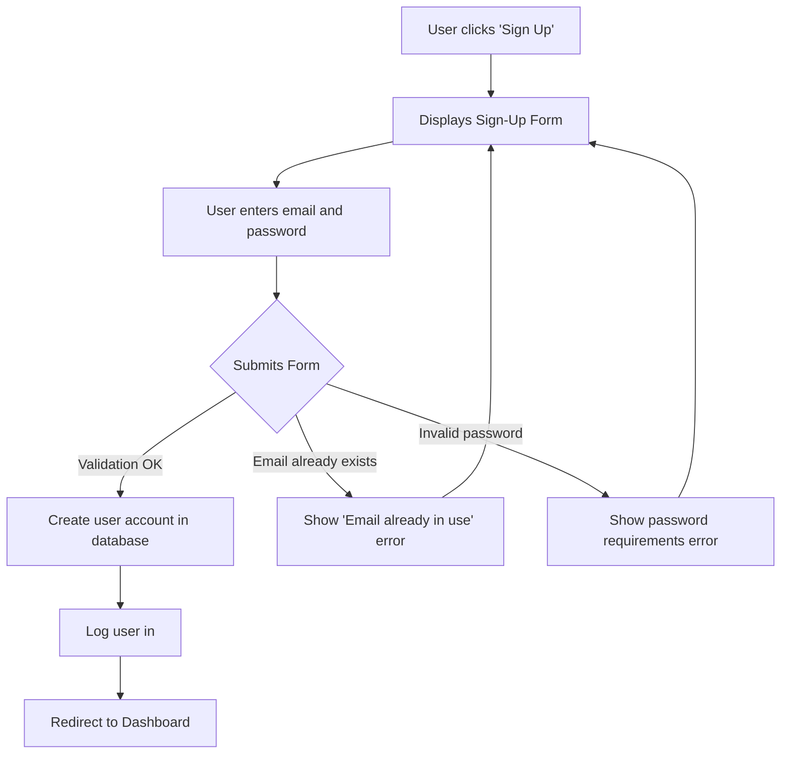
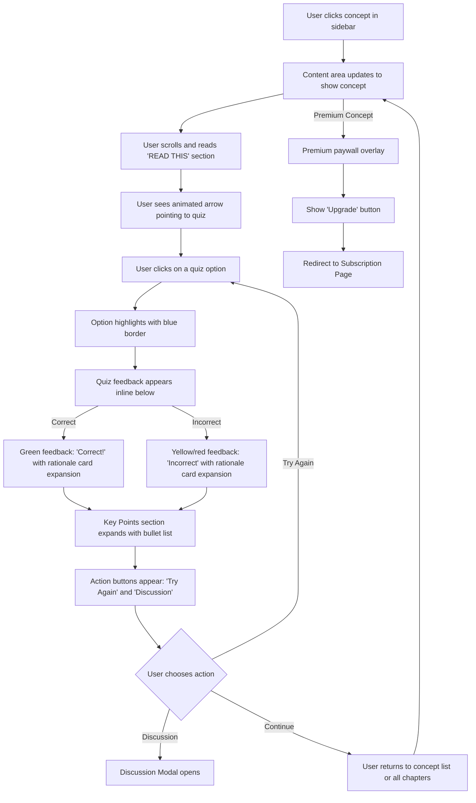
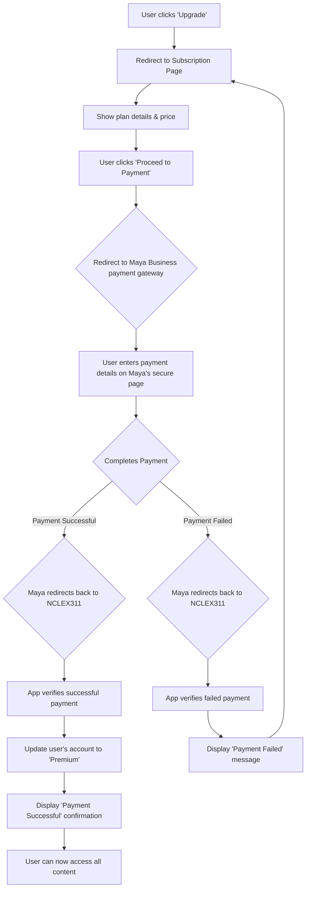
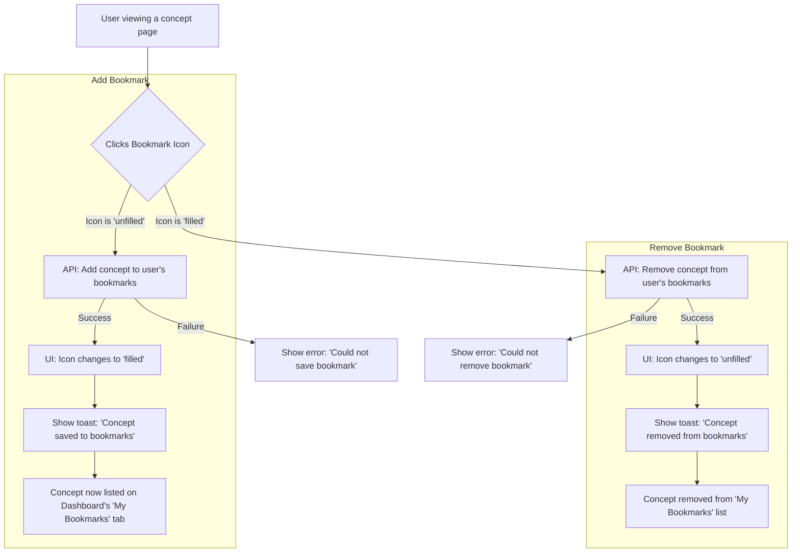
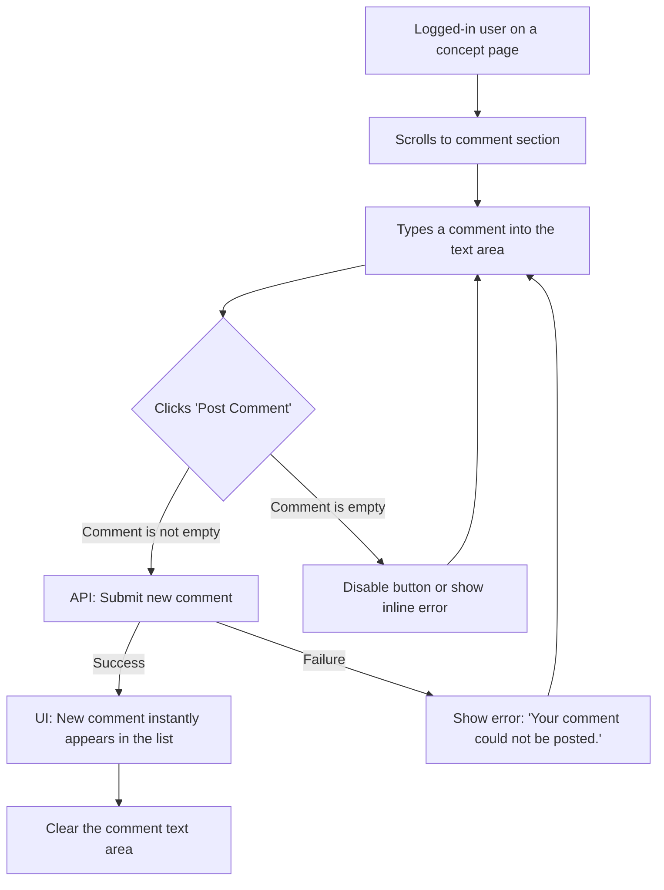

# NCLEX311-Web UI/UX Specification

## Introduction

This document defines the user experience goals, information architecture, user flows, and visual design specifications for NCLEX311-Web's user interface. It serves as the foundation for visual design and frontend development, ensuring a cohesive and user-centered experience.

### Overall UX Goals & Principles

#### Target User Personas
- **Aspiring Nurses (Philippines & Overseas):** Tech-savvy individuals preparing for the NCLEX-RN exam who need an engaging, convenient, and personalized study tool. They are likely to be using mobile devices primarily.
- **Content Managers:** Internal users who need to manage the application's content, including concepts, questions, and comments.

#### Usability Goals
- **Engaging & Supportive:** The platform should feel encouraging and help users study effectively.
- **Intuitive & Mobile-First:** The user interface must be easy to navigate, especially on mobile devices.
- **Efficient Learning:** Users should be able to quickly find content, take quizzes, and get feedback to make their study sessions productive.

#### Design Principles
1.  **Mobile-First:** Design for the smallest screen first, then scale up.
2.  **Progressive Disclosure:** Reveal information contextually to avoid overwhelming the user.
3.  **Clarity and Simplicity:** The interface should be clean and easy to understand.
4.  **Instant Feedback:** Every user action should have a clear and immediate reaction.
5.  **Accessibility by Default:** Adherence to WCAG 2.1 AA standards.

---

## Information Architecture (IA)

### Site Map / Screen Inventory
```mermaid
graph TD
    subgraph Public Area
        A[Landing Page] --> B[Sign-Up]
        A --> C[Login]
    end

    subgraph Authenticated User Area
        C --> D{Concept Viewer with Sidebar}
        D --> E[All Chapters View]
        D --> F[Progress Dashboard]
        D --> G[Bookmarks View]
        D --> H[Notes Modal]
        D --> I[Discussion Modal]
        D -- Premium Content --> J[Upgrade to Premium]
        D --> K[Profile/Settings]
    end

    subgraph CMS (Admin)
        L[CMS Login] --> M[CMS Dashboard]
        M --> N[Content Management]
        M --> O[Comment Moderation]
    end
```

### Navigation Structure - REDESIGNED

**NEW ARCHITECTURE:** Sidebar-based navigation with persistent concept list and contextual views

*   **Primary Navigation (Sidebar):**
    *   **Desktop (≥768px):** Persistent left sidebar (280px width) with sticky positioning, always visible
    *   **Mobile (<768px):** Slide-out drawer sidebar triggered by hamburger menu (☰) in mobile header, with overlay background
    *   **Structure:**
        *   Logo and app title at top
        *   Current chapter's concept list (vertical scroll)
        *   Collapsible "View More/Less" to show all concepts in chapter (initial: 3-4 visible)
        *   Footer section with quick-access buttons: 📚 All Chapters, 📊 Progress, 🔖 Bookmarks
        *   Premium upsell banner integrated at sidebar bottom

*   **Concept List Items:**
    *   Display concept title and number
    *   Visual indicators: ✅ for completed concepts
    *   Active concept: Blue background (#e8f0fe) with left border accent (#2c5aa0)
    *   Hover state: Light blue background
    *   Click navigates to that concept (replaces content area)

*   **Content Area Views:** Main content area switches between:
    1. **Concept Viewer** (default) - Single concept with quiz, rationale, key points
    2. **All Chapters View** - Grid of all 8 chapters with progress indicators
    3. **Progress Dashboard** - Detailed progress tracking by chapter
    4. **Bookmarks View** - Grid of bookmarked concepts with notes

*   **Modals (Overlay):**
    *   **Notes Modal:** Full-screen overlay for personal note-taking
    *   **Discussion Modal:** Full-screen overlay for community discussions

*   **Breadcrumbs:** Not required in new design - sidebar provides persistent context

---

## User Flows

### Flow 1: New User Registration

*   **User Goal:** To create a new account to track personal study progress.
*   **Entry Points:** "Sign Up" button on the landing page or login screen.
*   **Success Criteria:** The user is successfully logged into their new account and redirected to the main dashboard.

#### Flow Diagram


### Flow 2: Browsing and Studying a Free Concept - REDESIGNED

*   **User Goal:** To read a concept and complete its quiz in a seamless, single-scroll experience.
*   **Entry Points:** Sidebar concept list, "All Chapters" view, or direct navigation.
*   **Success Criteria:** The user reads the concept, answers the quiz inline, views rationale, and can take follow-up actions (notes, discussion, bookmark).

#### Flow Diagram - NEW INLINE QUIZ PATTERN


### Flow 3: Premium Subscription Upgrade

*   **User Goal:** To unlock all content by purchasing the annual subscription.
*   **Entry Points:** Clicking an "Upgrade" button when prompted on premium content, or from a general "Upgrade" link in their profile/dashboard.
*   **Success Criteria:** The user's payment is successful, their account status is updated to "premium," and they gain immediate access to all chapters.

#### Flow Diagram


### Flow 4: Concept Bookmarking

*   **User Goal:** To save an important or difficult concept for quick review later.
*   **Entry Points:** The "Bookmark" icon/button on any concept page.
*   **Success Criteria:** The concept is successfully added to or removed from the user's personal bookmark list, with immediate visual feedback.

#### Flow Diagram


### Flow 5: Post a Comment

*   **User Goal:** To ask a question or share knowledge with other users on a concept page.
*   **Entry Points:** The comment input form in the "Community" section of a concept page.
*   **Success Criteria:** The user's comment is successfully submitted and appears in the comment list for others to see.

#### Flow Diagram


---

## Wireframes & Mockups

**Primary Design Files:** The visual designs and prototypes should be created in a dedicated design tool (e.g., Figma, Sketch, Adobe XD). This document will serve as the primary reference for those designs.

### Key Screen Layouts

#### Screen: Main Layout (Sidebar + Content Area) - REDESIGNED

*   **Purpose:** Primary application layout providing persistent navigation and contextual content display.
*   **Layout Structure:**
    *   **Two-column layout on desktop:** Sidebar (280px fixed) + Content Area (flexible, max-width 800px)
    *   **Single-column on mobile:** Content area full-width, sidebar as slide-out drawer

##### Left Sidebar (Navigation)
*   **Desktop Behavior:** Always visible, sticky positioned, scrolls independently
*   **Mobile Behavior:** Hidden by default, slides in from left when hamburger (☰) clicked, overlay dims background
*   **Sidebar Sections:**
    1.  **Header:**
        *   Logo (Ray Gapuz Review System, 60px height)
        *   App title: "NCLEX 311" (blue, 1.3rem)
        *   Subtitle: "Functional Nursing Concepts" (gray, 0.85rem)
    2.  **Concept List (Scrollable):**
        *   Current chapter title (uppercase, small, gray)
        *   Concept items (padding 0.75rem, rounded corners)
        *   Completed concepts: Green checkmark ✅ prefix
        *   Active concept: Blue background (#e8f0fe) with left border (#2c5aa0)
        *   Initially shows 3-4 concepts, rest hidden
        *   "View More" button expands to show all ~30 concepts
    3.  **Footer:**
        *   Quick action buttons (full-width, stacked):
            *   📚 All Chapters
            *   📊 Progress  
            *   🔖 Bookmarks
        *   Premium upsell banner:
            *   Title: "🚀 Unlock Premium"
            *   Description: "Access all 323 concepts across 8 chapters"
            *   "Upgrade Now" button (small, blue)

##### Mobile Header (Mobile Only)
*   **Visible only on <768px screens**
*   **Background:** Blue (#2c5aa0)
*   **Content:** App title, hamburger menu (☰) on right
*   **Interaction:** Hamburger opens sidebar drawer with overlay

*   **Interaction Notes:**
    *   Clicking any concept in sidebar loads that concept in content area (no page reload)
    *   Sidebar stays visible on desktop during navigation
    *   Mobile: Sidebar auto-closes after concept selection
    *   Visual feedback: Hover states on all interactive elements

#### Screen: Concept/Quiz Viewer - REDESIGNED

*   **Purpose:** Single-scroll experience for reading concept, taking quiz, and accessing additional features.
*   **Layout:** Right content area (sidebar remains visible on desktop)

##### Content Header
*   **Bookmark Button:** Star icon (☆/★) in top-right corner (44px tap target)
*   **Title:** Concept title (H1, 1.75rem desktop, dark gray)
*   **Meta:** "Functional Nursing Concept #X | Chapter Name" (small, gray text)
*   **Bottom Border:** 2px blue underline

##### Content Body (Vertical Scroll)

**1. "READ THIS" Section**
*   **Visual Treatment:**
    *   Warm gradient background (orange tones: #fff8f3 to #fef7f0)
    *   Left border: 4px solid orange (#ff6b35)
    *   Rounded corners (8px)
    *   Padding: 1.5rem
*   **Content:**
    *   Heading: "📖 READ THIS" (red color, 1.1rem, bold)
    *   Concept explanation text with markdown formatting support
    *   Key terms in **bold**

**2. Visual Arrow Element (NEW)**
*   **Purpose:** Visual transition from concept to quiz
*   **Design:**
    *   Vertical gradient line (orange to blue, 40px height)
    *   Downward arrow head (blue)
    *   Pill-shaped label: "Test your knowledge!" (blue background, white text)
    *   Centered between sections

**3. "ANSWER THIS" Quiz Section**
*   **Visual Treatment:**
    *   Cool gradient background (blue tones: #f0f8ff to #e6f3ff)
    *   Left border: 4px solid blue (#2c5aa0)
    *   Rounded corners (8px)
*   **Content:**
    *   Heading: "🧠 ANSWER THIS" (blue, 1.1rem, bold)
    *   **Quiz Question Card:**
        *   White background, shadow, rounded
        *   Question text (H4, 1rem, line-height 1.5)
        *   **Answer Options:**
            *   White cards with 2px border (#e1e7f0)
            *   Hover: Blue border, slight lift animation
            *   Selected: Blue border, light blue background
            *   Correct (post-submission): Green border, green background
            *   Incorrect (post-submission): Red/orange border, yellow background
            *   Minimum height: 44px (touch-friendly)

**4. Quiz Feedback (Appears on Answer Selection)**
*   **Correct:** Green feedback card with "✓ Correct!" message
*   **Incorrect:** Yellow/red feedback card with "✗ Try Again" message

**5. Rationale Section (Expands After Answer)**
*   **Background:** Light gray (#f8f9fc)
*   **Heading:** "📋 Rationale" (H4)
*   **Content:** Detailed explanation with markdown support

**6. Key Points Section (Expands After Answer)**
*   **Background:** Light yellow (#fff9e6)
*   **Left Border:** 4px orange
*   **Heading:** "🔑 Key Points" (orange)
*   **Content:** Bullet list of key takeaways

**7. Reference Section**
*   **Background:** Light gray
*   **Heading:** "📚 Reference" (H4)
*   **Content:** Citation information (author, title, publisher)

**8. Action Buttons**
*   **Grid Layout (responsive):**
    *   💬 Discussion (Primary blue button)
    *   ✅ Mark Complete (Outline button)
    *   📝 Take Notes (Outline button)
*   **Mobile:** Stacked vertically
*   **Desktop:** Horizontal grid

*   **Interaction Notes:**
    *   Quiz answers are clickable cards (not radio buttons)
    *   No "Submit" button - answer selection triggers immediate feedback
    *   Rationale and key points expand with smooth animation
    *   After answering, "Try Again" and "Discussion" buttons appear
    *   Bookmark icon toggles between ☆ (unfilled) and ★ (filled, orange)
    *   Toast notification on bookmark/complete actions

#### Modal: Personal Notes (NEW)

*   **Purpose:** Allow users to write personal notes about a concept for later review.
*   **Trigger:** Clicking "📝 Take Notes" button on concept page
*   **Layout:** Full-screen modal overlay (mobile) or centered modal (desktop)
*   **Structure:**
    1.  **Header (Blue Background):**
        *   Title: "📝 Personal Notes"
        *   Close button (×) in top-right (44px tap target)
    2.  **Concept Info Banner:**
        *   Concept title (H4, bold)
        *   Meta info: "Chapter Name • Concept #X"
    3.  **Content Area (Scrollable):**
        *   **Tips Section:**
            *   Light blue background (#e8f0fe)
            *   Heading: "💡 Note-Taking Tips"
            *   Bullet list of suggestions
        *   **Textarea:**
            *   Large text input (min 150px height)
            *   Placeholder text with examples
            *   Character counter: "X / 2000 characters"
            *   Resizable (vertical only)
    4.  **Footer Actions:**
        *   "Cancel" button (outline)
        *   "💾 Save Notes" button (primary blue)
*   **Interaction Notes:**
    *   Modal dims background with 50% opacity overlay
    *   Clicking overlay or close button closes modal
    *   Unsaved changes prompt warning before closing
    *   Saves to user's profile, associated with concept

#### Modal: Discussion/Community (NEW)

*   **Purpose:** Facilitate community discussion and Q&A about each concept.
*   **Trigger:** Clicking "💬 Discussion" button on concept page
*   **Layout:** Full-screen modal overlay (mobile) or centered modal (desktop)
*   **Structure:**
    1.  **Header (Blue Background):**
        *   Title: "💬 Discussion: [Concept Name]"
        *   Close button (×) in top-right
    2.  **New Post Form:**
        *   Background: Light gray (#f8f9fc)
        *   Post type selector:
            *   💬 Discussion button (default active)
            *   ❓ Question button
        *   Textarea: "Share your thoughts..."
        *   User indicator: "Posting as: [Name] (Student)"
        *   "📤 Post" button (primary blue)
    3.  **Discussion Feed (Scrollable):**
        *   **Instructor Posts (Pinned):**
            *   Green border (#00b894)
            *   Avatar circle with "Dr" or initials
            *   Badges: "Instructor" (green), "Pinned" (yellow)
            *   Post content with formatting
            *   Engagement: 👍 Like count, 💬 Reply count
        *   **Student Posts:**
            *   White background, gray border
            *   Avatar circle with initial
            *   Author name, "Student" role, timestamp
            *   Post content
            *   Engagement buttons: 👍 Like, 💬 Reply
*   **Interaction Notes:**
    *   Posts load dynamically as user scrolls
    *   Like button toggles blue when active
    *   Reply button opens nested comment thread
    *   Instructor posts always shown at top

#### View: All Chapters Grid (NEW)

*   **Purpose:** Display all 8 chapters with progress indicators and access controls.
*   **Trigger:** Clicking "📚 All Chapters" button in sidebar
*   **Layout:** Replaces concept viewer in content area
*   **Structure:**
    1.  **Back Button:** "← Back to Current Chapter" (full-width, blue)
    2.  **Header:**
        *   Title: "📚 All NCLEX 311 Chapters & Concepts" (H1, centered)
        *   Subtitle: "Complete overview of all 323 Functional Nursing Concepts"
        *   Search bar: "🔍 Search concepts..." (real-time filter)
    3.  **Stats Overview (4-column grid, 2x2 on mobile):**
        *   "144 Free Concepts Available"
        *   "179 Premium Concepts"
        *   "19 Concepts Completed"
        *   "85% Average Quiz Score"
    4.  **Chapter Cards Grid:**
        *   **Grid Layout:** Auto-fit, min 320px per card
        *   **Free Chapters (1-4):**
            *   Badge: "Free" (green)
            *   Chapter title and page range
            *   Progress bar with percentage
            *   Concept preview list (3 items)
            *   "Continue Learning" button (blue)
        *   **Premium Chapters (5-8):**
            *   Badge: "Premium" (yellow/orange)
            *   Locked progress bar
            *   🔒 lock icons on concepts
            *   "🚀 Upgrade to Premium" button (yellow bg)
*   **Interaction Notes:**
    *   Search filters cards in real-time
    *   Clicking free chapter card navigates to first concept
    *   Clicking premium card shows upgrade modal
    *   Progress bars animate on load

#### View: Progress Dashboard (NEW)

*   **Purpose:** Detailed progress tracking by chapter with completion statistics.
*   **Trigger:** Clicking "📊 Progress" button in sidebar
*   **Layout:** Replaces concept viewer in content area
*   **Structure:**
    1.  **Back Button:** "← Back to Current Chapter"
    2.  **Header:**
        *   Title: "📊 Your Learning Progress" (H1, centered)
        *   Subtitle: "Track your mastery of NCLEX 311 concepts"
    3.  **Stats Overview (4-column grid):**
        *   "3 Concepts Completed"
        *   "85% Average Quiz Score"
        *   "144 Free Concepts Available"
        *   "6 Concepts Bookmarked"
    4.  **Progress Details Section:**
        *   Heading: "Completed Concepts by Chapter" (H3)
        *   **Chapter Progress Cards:**
            *   Chapter title (H4, blue)
            *   Completion count: "(3/30 Concepts Completed)"
            *   Progress bar (animated, green gradient)
            *   **Completed Concepts List:**
                *   ✅ Concept name (Concept #X)
                *   If none: "No concepts completed in this chapter yet."
*   **Interaction Notes:**
    *   Progress bars animate on load
    *   Clicking concept name navigates to that concept
    *   Stats update in real-time

#### View: Bookmarks Grid (NEW)

*   **Purpose:** Display all bookmarked concepts with personal notes and quick actions.
*   **Trigger:** Clicking "🔖 Bookmarks" button in sidebar
*   **Layout:** Replaces concept viewer in content area
*   **Structure:**
    1.  **Back Button:** "← Back to Current Chapter"
    2.  **Header:**
        *   Title: "🔖 My Bookmarks" (H1, centered)
        *   Subtitle: "Your saved concepts for quick reference and review"
    3.  **Bookmark Stats (4-column grid):**
        *   "6 Total Bookmarks"
        *   "4 From Free Concepts"
        *   "2 Recent This Week"
        *   "3 Study Sessions"
    4.  **Filter Buttons:**
        *   Pill-shaped buttons in horizontal row
        *   Options: All Bookmarks, Recent, By Chapter, With Notes
        *   Active button: Blue background
    5.  **Bookmark Cards Grid:**
        *   **Auto-fit grid, min 300px per card**
        *   **Card Structure:**
            *   Header (light gray background):
                *   Concept title (bold)
                *   Meta: "Chapter • Concept #X"
                *   Date: "Bookmarked X time ago"
                *   Star button (★, orange) in top-right
            *   Content:
                *   Concept preview text (gray, small)
                *   Personal note (if exists): Yellow box with "📝 Personal Note:" prefix
            *   Actions (horizontal buttons):
                *   "📖 Study" (primary blue)
                *   "🧠 Quiz" (primary blue)
                *   "🗑️ Remove" (red)
    6.  **Empty State (if no bookmarks):**
        *   Large 🔖 icon
        *   "No Bookmarks Yet" heading
        *   "Start bookmarking concepts.." message
        *   "Browse Concepts" button
*   **Interaction Notes:**
    *   Filter buttons toggle visibility of cards
    *   Star button toggles bookmark status
    *   Study button navigates to concept
    *   Quiz button scrolls to quiz section
    *   Remove button shows confirmation, then removes

#### Screen: Subscription/Upgrade Page

*   **Purpose:** To persuade free users to upgrade by clearly communicating the benefits of the premium plan and providing a simple, secure payment process.
*   **Key Elements:**
    *   **Compelling Headline:** A large, clear headline like "Unlock Your Full Potential" or "Go Premium".
    *   **Value Proposition List:** A bulleted list highlighting what the user gets with a premium subscription. Examples:
        *   ✅ Access to all 323 NCLEX concepts
        *   ✅ Full library of quiz questions and rationales
        *   ✅ Bookmark and track progress on all content
        *   ✅ One-time payment, full year access
    *   **Clear Pricing:** The annual price displayed prominently (e.g., "₱X,XXX for one year").
    *   **Primary Call-to-Action (CTA):** A large, high-contrast button that says "Upgrade Now via Maya".
    *   **Trust Signals:** The Maya Business logo should be clearly visible to build trust. A small note like "Secure payment processed by Maya" can also help.
    *   **"No thanks" Link:** A simple link to return to the previous page for users who are not ready to buy.
*   **Interaction Notes:**
    *   This page should be extremely focused, with minimal distractions. No main navigation bar is needed here, just a clear path to payment or back.
    - Clicking the CTA button will take the user off-site to the Maya Business payment portal.

---

## Component Library / Design System

### Design System Approach

For a new application like this, I recommend **adopting an existing, mature component library** for React, such as **Material-UI (MUI)**, **Chakra UI**, or a similar library that is compatible with Next.js.

**Rationale:**
*   **Speed:** It's much faster than building a design system from scratch.
*   **Consistency:** Ensures a consistent look and feel across the entire application.
*   **Accessibility:** These libraries have accessibility built-in, which helps us meet our WCAG AA target.
*   **Best Practices:** They incorporate established UX/UI best practices.

We can then customize the theme (colors, fonts, spacing) of the chosen library to match the NCLEX 311 branding.

### Core Components (Revised)

Here are some of the foundational components we will need, based on the screens we've discussed.

1.  **Button:**
    *   **Purpose:** For all user-initiated actions.
    *   **Variants:** `Primary` (for "Upgrade Now"), `Secondary` (for "Mark as Complete"), `Text` (for "Cancel").
    *   **States:** Default, Hover, Focused, Disabled, Loading.

2.  **Accordion:**
    *   **Purpose:** To display the list of chapters, which expand to show the concepts within.
    *   **States:** Expanded, Collapsed.

3.  **Tabs:**
    *   **Purpose:** To switch between the "All Concepts," "My Bookmarks," and "Completed" views on the dashboard.
    *   **States:** Active, Inactive.

4.  **Quiz Answer:**
    *   **Purpose:** A component for displaying and interacting with a quiz question.
    *   **Variants:**
        *   `Radio Button` (for single-choice questions).
        *   `Checkbox` (for "Select All That Apply").
        *   `Text Input` (for Fill-in-the-blank).
        *   `Matrix/Grid` (for questions requiring associations in a grid).
    *   **States:** Default, Selected/Filled, Correct, Incorrect.

5.  **Toast Notification:**
    *   **Purpose:** To show brief, temporary messages like "Concept bookmarked."
    *   **Variants:** Success, Error, Info.

---

## Branding & Style Guide

### Visual Identity
*   **Brand Guidelines:** The visual identity is based on the `sample_chapter_demo_v23.html` file and the Ray A. Gapuz Review System logo.

### Color Palette
The palette is professional and clean, using a primary blue for trust and an orange accent for encouragement and key actions.

| Color Type | Hex Code  | Usage                                                     |
| :--------- | :-------- | :-------------------------------------------------------- |
| Primary    | `#2c5aa0` | Main headers, primary buttons, active links, icons        |
| Accent     | `#ff6b35` | Bookmarks, key callouts, some borders                     |
| Success    | `#00b894` | Correct answers, success messages, "Free" badges          |
| Warning    | `#ffeaa7` | "Premium" badge backgrounds, incorrect answer backgrounds |
| Error      | `#e17055` | Incorrect answer borders, "Premium" badge text            |
| Text       | `#2c3e50` | Main body text, headlines                                 |
| Secondary Text | `#6c757d` | Meta information, subtitles, disabled text              |
| Borders/BG | `#e1e7f0` | Borders, dividers, light backgrounds                      |

### Typography
The typography uses a standard system font stack for broad compatibility and readability.

*   **Font Families:**
    *   **Primary:** System Font Stack (`-apple-system`, `BlinkMacSystemFont`, `'Segoe UI'`, `Roboto`, `sans-serif`)
*   **Type Scale (based on 16px root):**
    *   **H1 (Page Title):** 28px (1.75rem), 600 weight
    *   **H2 (Header Title):** 19px (1.2rem), 600 weight
    *   **H3 (Section Title):** 18px (1.1rem), 600 weight
    *   **Body:** 16px, Regular
    *   **Small/Meta:** 14px (0.9rem), 500 weight

### Iconography
*   **Icon Library:** To ensure high-quality and consistent icons, I recommend using a library like **Material Icons** or **Feather Icons**, styled to match the color palette.

### Spacing & Layout
*   **Grid System:** A standard 12-column responsive grid.
*   **Spacing Scale:** A consistent 8px spacing scale should be used for margins and padding (e.g., 8px, 16px, 24px) to match the rhythm of the demo.
*   **Corner Radius:** A `6px` or `8px` border-radius is used for buttons, cards, and inputs to create a soft, modern feel.

---

## Accessibility Requirements

### Compliance Target
*   **Standard:** WCAG 2.1, Level AA

### Key Requirements

#### Visual
*   **Color Contrast:** All text must have a minimum contrast ratio of **4.5:1** against its background. Large text (18pt or 14pt bold) must have a ratio of at least **3:1**. The chosen color palette must be verified against this standard.
*   **Focus Indicators:** Every interactive element (links, buttons, form fields) must have a highly visible focus outline when navigated to via a keyboard, as demonstrated in the sample HTML file.
*   **Text Resizing:** Users must be able to zoom or resize text up to 200% without breaking the layout or losing functionality.

#### Interaction
*   **Keyboard Navigation:** All features and content must be fully accessible and operable using only a keyboard. The tab order must be logical and follow the visual flow of the page.
*   **Screen Reader Support:** The application must be built with semantic HTML (e.g., using `<nav>`, `<main>`, `<button>`) and ARIA attributes where necessary to ensure it is fully compatible with screen readers like VoiceOver, NVDA, and JAWS.
*   **Touch Targets:** All interactive elements must have a minimum touch target size of **44x44 pixels** to be easily used on mobile devices.

#### Content
*   **Alternative Text:** All meaningful images must have descriptive `alt` text.
*   **Heading Structure:** Page content must be structured with headings (`<h1>`, `<h2>`, etc.) in the correct logical order.
*   **Form Labels:** All form inputs must have clear, programmatically associated `<label>` elements.

### Testing Strategy
*   **Automated Testing:** Integrate accessibility checking tools (like Axe) into the development process and CI/CD pipeline to catch common violations automatically.
*   **Manual Testing:**
    1.  Regularly perform keyboard-only navigation tests on all user flows.
    2.  Manually test key user flows using a screen reader.
    3.  Use a color contrast analysis tool to validate design mockups and final implementation.

---

## Responsiveness Strategy

The application will be built using a **mobile-first** approach. This means we will design for the smallest screen size first and then progressively enhance the layout for larger screens. This ensures a great experience on all devices, which is critical for our target users.

### Breakpoints
We will use a standard set of breakpoints to control how the layout adapts. The primary layout shift will happen at `768px`, as seen in the sample file.

| Breakpoint | Min Width | Target Devices                               |
| :--------- | :-------- | :------------------------------------------- |
| Mobile     | 320px     | Small to large mobile phones                 |
| Tablet     | 768px     | Tablets, small laptops                       |
| Desktop    | 1024px    | Standard desktop and laptop screens          |
| Wide       | 1440px    | Large, high-resolution monitors              |

### Adaptation Patterns

*   **Layout:**
    *   **Mobile:** A single-column layout is used for all content, making it easy to scroll and read. The main navigation is tucked into a slide-out sidebar.
    *   **Tablet (768px+):** The sidebar becomes sticky and is always visible on the left. The main content area may use two or more columns for things like the chapter grid or dashboard stats.
    *   **Desktop (1024px+):** The main content area will have a maximum width to ensure text remains readable and doesn't stretch too wide.

*   **Navigation:**
    *   **Mobile:** A "hamburger" menu icon in the header will toggle the visibility of the main navigation sidebar.
    *   **Tablet+:** The sidebar navigation is permanently visible, providing one-click access to all main sections.

*   **Content:**
    *   Content is prioritized vertically on mobile. On larger screens, related content (like "Key Points") might be moved into a secondary column alongside the main content.

*   **Interactions:**
    *   All interactions will be designed for touch first. Hover effects on desktop will be an enhancement, not a requirement for functionality.

---

## Animation & Micro-interactions

### Motion Principles

1.  **Purposeful:** Animations must have a purpose, such as providing feedback, guiding focus, or illustrating a change in state.
2.  **Subtle & Quick:** Motion should be fast (typically 150-300ms) and subtle to feel responsive, not sluggish.
3.  **Consistent:** Similar elements should animate in the same way to create a predictable experience.
4.  **Accessible:** We must respect the `prefers-reduced-motion` browser setting and disable non-essential animations for users who have it enabled.

### Key Animations

*   **State Changes (Hover/Press):**
    *   **Description:** When a user hovers over a button, link, or card, it will have a subtle "lift" (using `box-shadow` and `transform`) or a smooth color transition to indicate it's interactive.
    *   **Duration:** 150ms, `ease-out`

*   **Quiz Feedback:**
    *   **Description:** When a quiz answer is submitted, the options will smoothly transition to their "correct" or "incorrect" background colors. The rationale section will fade in smoothly below.
    *   **Duration:** 250ms, `ease-in-out`

*   **Sidebar & Modals:**
    *   **Description:** On mobile, the sidebar will slide in from the left. Modals (for notes, discussion, etc.) will fade in with a slight scaling effect to draw focus.
    *   **Duration:** 300ms, `ease-out`

*   **Accordion Expand/Collapse:**
    *   **Description:** When a user clicks on a chapter in the "All Concepts" list, the list of concepts within that chapter will smoothly expand down, rather than just appearing abruptly.
    *   **Duration:** 250ms, `ease-in-out`

---

## Performance Considerations

*   **Performance Goals:**
    *   **Page Load Time:** We will target a load time of **under 3 seconds** on a standard mobile connection, as specified in the PRD.
    *   **Interaction Response:** User interactions (clicks, taps) should provide feedback in **under 200ms**.
*   **Design Strategies to Achieve Goals:**
    *   **Image Optimization:** All images will be compressed and served in a modern format like WebP.
    *   **Lazy Loading:** Images, comments, and other content that is not immediately visible will be loaded on demand as the user scrolls.
    *   **Skeleton Screens:** When loading data (like the dashboard), the app will show a grayed-out "skeleton" of the layout to improve perceived performance.

---

## Next Steps

This UI/UX Specification is now complete. Here is the plan for moving forward.

*   **Immediate Actions:**
    1.  **Review & Approve:** This document should be reviewed by the Product Manager and key stakeholders.
    2.  **Create Visual Designs:** A visual designer can now use this specification as a blueprint to create high-fidelity mockups in a tool like Figma.
    3.  **Handoff to Architect:** This document is ready for the Architect, who will use it to create the detailed front-end architecture.
*   **Open Questions:**
    *   The specific brand guidelines (logo files, exact hex codes, font files) for the "Ray A. Gapuz" review system need to be provided.

#### Design Handoff Checklist
- [x] All user flows documented
- [x] Component inventory complete
- [x] Accessibility requirements defined
- [x] Responsive strategy clear
- [x] Brand guidelines incorporated
- [x] Performance goals established
