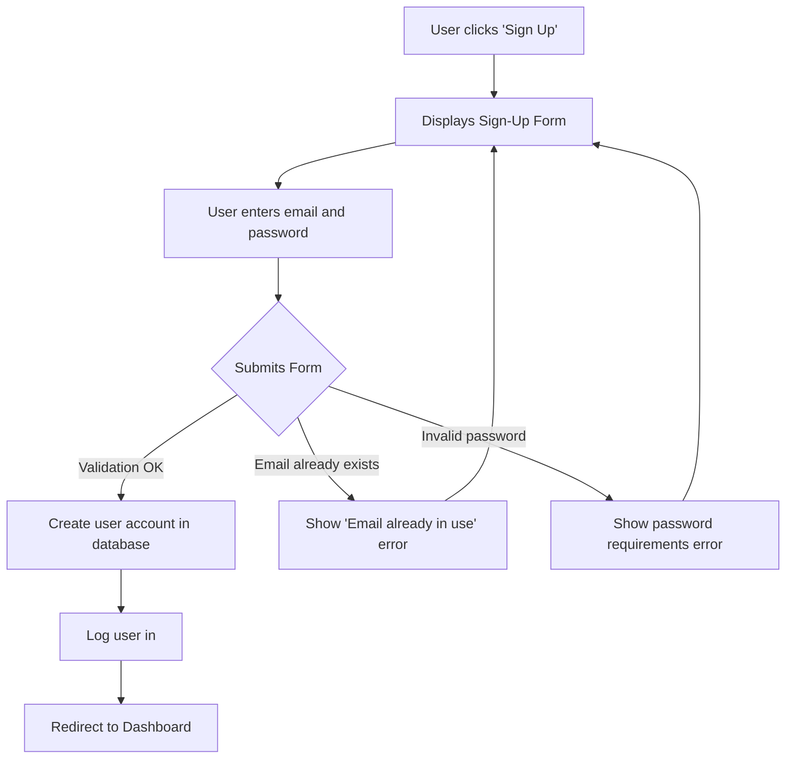
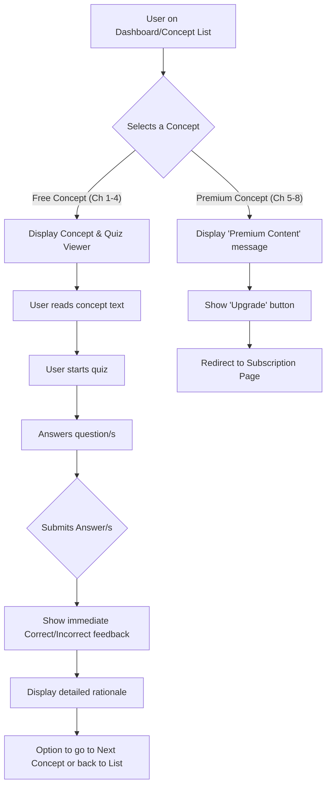
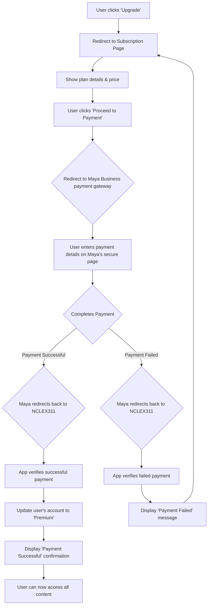
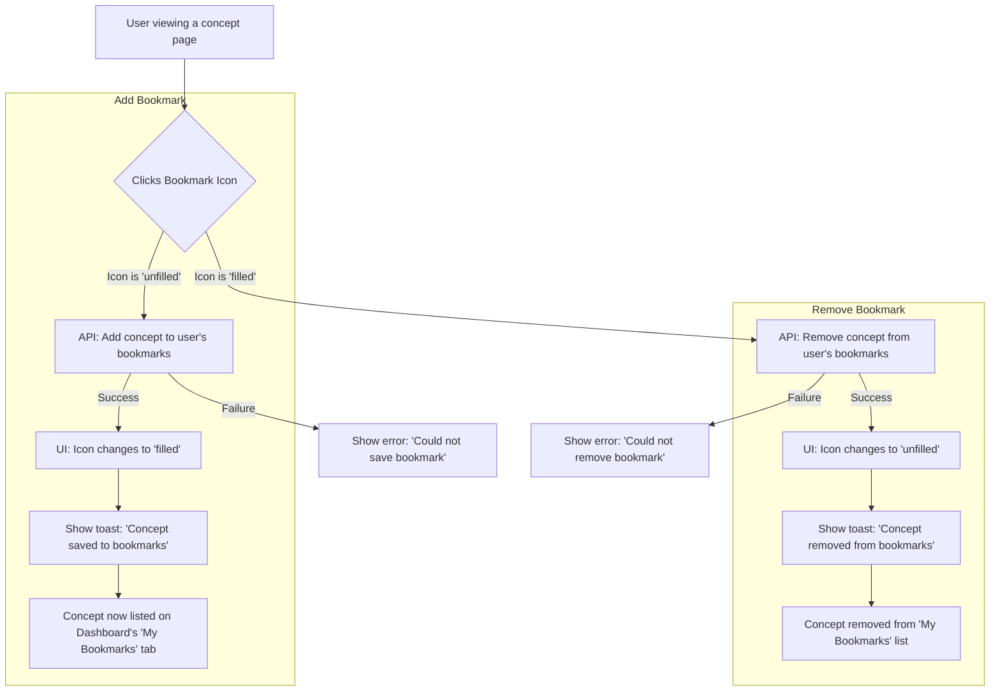
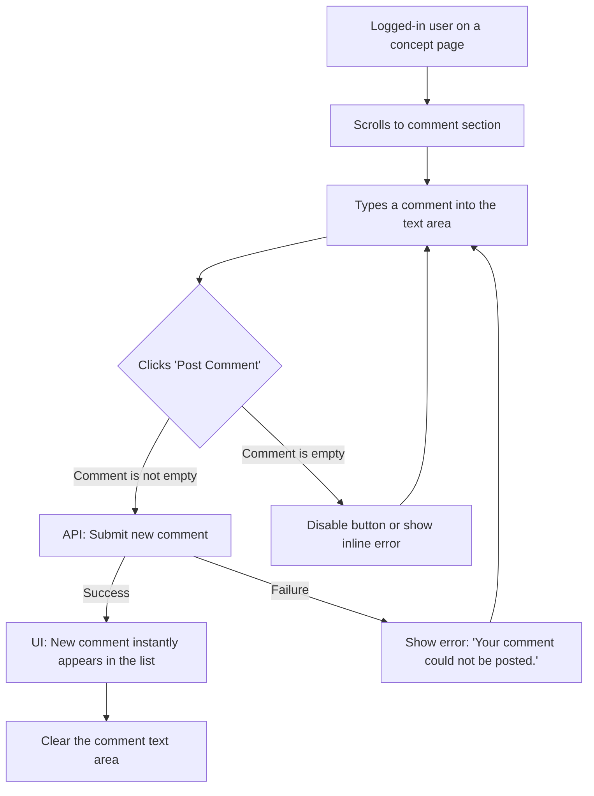

# NCLEX311-Web UI/UX Specification

## Introduction

This document defines the user experience goals, information architecture, user flows, and visual design specifications for NCLEX311-Web's user interface. It serves as the foundation for visual design and frontend development, ensuring a cohesive and user-centered experience.

### Overall UX Goals & Principles

#### Target User Personas
- **Aspiring Nurses (Philippines & Overseas):** Tech-savvy individuals preparing for the NCLEX-RN exam who need an engaging, convenient, and personalized study tool. They are likely to be using mobile devices primarily.
- **Content Managers:** Internal users who need to manage the application's content, including concepts, questions, and comments.

#### Usability Goals
- **Engaging & Supportive:** The platform should feel encouraging and help users study effectively.
- **Intuitive & Mobile-First:** The user interface must be easy to navigate, especially on mobile devices.
- **Efficient Learning:** Users should be able to quickly find content, take quizzes, and get feedback to make their study sessions productive.

#### Design Principles
1.  **Mobile-First:** Design for the smallest screen first, then scale up.
2.  **Progressive Disclosure:** Reveal information contextually to avoid overwhelming the user.
3.  **Clarity and Simplicity:** The interface should be clean and easy to understand.
4.  **Instant Feedback:** Every user action should have a clear and immediate reaction.
5.  **Accessibility by Default:** Adherence to WCAG 2.1 AA standards.

---

## Information Architecture (IA)

### Site Map / Screen Inventory
```mermaid
graph TD
    subgraph Public Area
        A[Landing Page] --> B[Sign-Up]
        A --> C[Login]
    end

    subgraph Authenticated User Area
        C --> D{Dashboard}
        D --> E[Browse Chapters/Concepts]
        E --> F[Concept & Quiz Viewer]
        F --> G[Comments]
        D --> H[My Bookmarks]
        D --> I[My Progress]
        D --> J[Profile/Settings]
        E -- Premium Content --> K[Upgrade to Premium]
    end

    subgraph CMS (Admin)
        L[CMS Login] --> M[CMS Dashboard]
        M --> N[Content Management]
        M --> O[Comment Moderation]
    end
```

### Navigation Structure

*   **Primary Navigation (for logged-in users):** A persistent header containing links to:
    *   Dashboard
    *   Browse All Concepts
    *   A user menu with options for Profile, Settings, and Logout.
*   **Secondary Navigation:**
    *   On the Dashboard, we could use tabs for "All Concepts", "My Bookmarks", and "My Progress".
    *   When viewing a concept, breadcrumbs like `Home > Chapter 4 > Concept 4.2` will help with orientation.
*   **Breadcrumb Strategy:** We will use breadcrumbs to show the user's location within the content hierarchy, for example: `Dashboard > Endocrine System > Diabetes Mellitus`.

---

## User Flows

### Flow 1: New User Registration

*   **User Goal:** To create a new account to track personal study progress.
*   **Entry Points:** "Sign Up" button on the landing page or login screen.
*   **Success Criteria:** The user is successfully logged into their new account and redirected to the main dashboard.

#### Flow Diagram


### Flow 2: Browsing and Studying a Free Concept

*   **User Goal:** To evaluate the platform's value by accessing free content and taking a quiz.
*   **Entry Points:** The main dashboard or the "Browse All Concepts" page.
*   **Success Criteria:** The user successfully reads a concept, completes its quiz, and views the feedback and rationale.

#### Flow Diagram


### Flow 3: Premium Subscription Upgrade

*   **User Goal:** To unlock all content by purchasing the annual subscription.
*   **Entry Points:** Clicking an "Upgrade" button when prompted on premium content, or from a general "Upgrade" link in their profile/dashboard.
*   **Success Criteria:** The user's payment is successful, their account status is updated to "premium," and they gain immediate access to all chapters.

#### Flow Diagram


### Flow 4: Concept Bookmarking

*   **User Goal:** To save an important or difficult concept for quick review later.
*   **Entry Points:** The "Bookmark" icon/button on any concept page.
*   **Success Criteria:** The concept is successfully added to or removed from the user's personal bookmark list, with immediate visual feedback.

#### Flow Diagram


### Flow 5: Post a Comment

*   **User Goal:** To ask a question or share knowledge with other users on a concept page.
*   **Entry Points:** The comment input form in the "Community" section of a concept page.
*   **Success Criteria:** The user's comment is successfully submitted and appears in the comment list for others to see.

#### Flow Diagram


---

## Wireframes & Mockups

**Primary Design Files:** The visual designs and prototypes should be created in a dedicated design tool (e.g., Figma, Sketch, Adobe XD). This document will serve as the primary reference for those designs.

### Key Screen Layouts

#### Screen: Main Dashboard

*   **Purpose:** To serve as the user's central hub, providing an overview of all content and personalized lists.
*   **Key Elements:**
    *   **Header:** Contains the app logo, primary navigation (Dashboard, Browse, Profile), and a search bar.
    *   **Welcome Message:** A simple, personalized greeting (e.g., "Welcome back, [User Name]!").
    *   **Tabbed Navigation:** A set of tabs to switch between three views:
        1.  **All Concepts:** The default view, showing a list of all chapters.
        2.  **My Bookmarks:** A list of concepts the user has bookmarked.
        3.  **Completed:** A list of concepts the user has marked as complete.
    *   **Content Area:** Displays the list of items corresponding to the selected tab. For "All Concepts," this will be an accordion-style list of chapters that expand to show the concepts within.
*   **Interaction Notes:**
    *   The search bar should filter the "All Concepts" list in real-time as the user types.
    *   Each concept in a list should be a clickable item that navigates to the `Concept/Quiz Viewer`.
    *   A clear visual indicator (e.g., a lock icon) should differentiate premium chapters/concepts from free ones.

#### Screen: Concept/Quiz Viewer

*   **Purpose:** To provide a focused view for reading a concept, taking the associated quiz, and reviewing the rationale.
*   **Key Elements:**
    *   **Header:** A minimal header showing the Chapter and Concept title. It should include a "Back" button to return to the list and a "Bookmark" icon.
    *   **Breadcrumbs:** e.g., `Chapter 2 > Cardiac Glycosides`
    *   **Concept Body:** The main text content of the concept, formatted for readability with clear headings and lists.
    *   **"Mark as Complete" Button:** A button or checkbox allowing users to track their progress.
    *   **Quiz Area:**
        *   A clear separator between the concept text and the quiz.
        *   The question is presented, followed by the answer options (e.g., radio buttons for multiple choice).
        *   A "Submit Answer" button.
    *   **Feedback/Rationale Area (Initially Hidden):**
        *   After submission, this area appears, showing whether the answer was correct or incorrect.
        *   The detailed rationale text is displayed below the feedback.
    *   **Navigation:** "Previous Concept" and "Next Concept" buttons at the very bottom to allow sequential study.
    *   **Comments Section:** Below the main content and quiz, allowing for community discussion.
*   **Interaction Notes:**
    *   The entire screen should be a single, scrollable view on mobile.
    - On submission, the page should not reload. The feedback and rationale should appear smoothly in place.
    *   The "Bookmark" and "Mark as Complete" actions should give immediate visual feedback (e.g., icon changes color, a small toast message appears).

#### Screen: Subscription/Upgrade Page

*   **Purpose:** To persuade free users to upgrade by clearly communicating the benefits of the premium plan and providing a simple, secure payment process.
*   **Key Elements:**
    *   **Compelling Headline:** A large, clear headline like "Unlock Your Full Potential" or "Go Premium".
    *   **Value Proposition List:** A bulleted list highlighting what the user gets with a premium subscription. Examples:
        *   ✅ Access to all 323 NCLEX concepts
        *   ✅ Full library of quiz questions and rationales
        *   ✅ Bookmark and track progress on all content
        *   ✅ One-time payment, full year access
    *   **Clear Pricing:** The annual price displayed prominently (e.g., "₱X,XXX for one year").
    *   **Primary Call-to-Action (CTA):** A large, high-contrast button that says "Upgrade Now via Maya".
    *   **Trust Signals:** The Maya Business logo should be clearly visible to build trust. A small note like "Secure payment processed by Maya" can also help.
    *   **"No thanks" Link:** A simple link to return to the previous page for users who are not ready to buy.
*   **Interaction Notes:**
    *   This page should be extremely focused, with minimal distractions. No main navigation bar is needed here, just a clear path to payment or back.
    - Clicking the CTA button will take the user off-site to the Maya Business payment portal.

---

## Component Library / Design System

### Design System Approach

For a new application like this, I recommend **adopting an existing, mature component library** for React, such as **Material-UI (MUI)**, **Chakra UI**, or a similar library that is compatible with Next.js.

**Rationale:**
*   **Speed:** It's much faster than building a design system from scratch.
*   **Consistency:** Ensures a consistent look and feel across the entire application.
*   **Accessibility:** These libraries have accessibility built-in, which helps us meet our WCAG AA target.
*   **Best Practices:** They incorporate established UX/UI best practices.

We can then customize the theme (colors, fonts, spacing) of the chosen library to match the NCLEX 311 branding.

### Core Components (Revised)

Here are some of the foundational components we will need, based on the screens we've discussed.

1.  **Button:**
    *   **Purpose:** For all user-initiated actions.
    *   **Variants:** `Primary` (for "Upgrade Now"), `Secondary` (for "Mark as Complete"), `Text` (for "Cancel").
    *   **States:** Default, Hover, Focused, Disabled, Loading.

2.  **Accordion:**
    *   **Purpose:** To display the list of chapters, which expand to show the concepts within.
    *   **States:** Expanded, Collapsed.

3.  **Tabs:**
    *   **Purpose:** To switch between the "All Concepts," "My Bookmarks," and "Completed" views on the dashboard.
    *   **States:** Active, Inactive.

4.  **Quiz Answer:**
    *   **Purpose:** A component for displaying and interacting with a quiz question.
    *   **Variants:**
        *   `Radio Button` (for single-choice questions).
        *   `Checkbox` (for "Select All That Apply").
        *   `Text Input` (for Fill-in-the-blank).
        *   `Matrix/Grid` (for questions requiring associations in a grid).
    *   **States:** Default, Selected/Filled, Correct, Incorrect.

5.  **Toast Notification:**
    *   **Purpose:** To show brief, temporary messages like "Concept bookmarked."
    *   **Variants:** Success, Error, Info.

---

## Branding & Style Guide

### Visual Identity
*   **Brand Guidelines:** The visual identity is based on the `sample_chapter_demo_v23.html` file and the Ray A. Gapuz Review System logo.

### Color Palette
The palette is professional and clean, using a primary blue for trust and an orange accent for encouragement and key actions.

| Color Type | Hex Code  | Usage                                                     |
| :--------- | :-------- | :-------------------------------------------------------- |
| Primary    | `#2c5aa0` | Main headers, primary buttons, active links, icons        |
| Accent     | `#ff6b35` | Bookmarks, key callouts, some borders                     |
| Success    | `#00b894` | Correct answers, success messages, "Free" badges          |
| Warning    | `#ffeaa7` | "Premium" badge backgrounds, incorrect answer backgrounds |
| Error      | `#e17055` | Incorrect answer borders, "Premium" badge text            |
| Text       | `#2c3e50` | Main body text, headlines                                 |
| Secondary Text | `#6c757d` | Meta information, subtitles, disabled text              |
| Borders/BG | `#e1e7f0` | Borders, dividers, light backgrounds                      |

### Typography
The typography uses a standard system font stack for broad compatibility and readability.

*   **Font Families:**
    *   **Primary:** System Font Stack (`-apple-system`, `BlinkMacSystemFont`, `'Segoe UI'`, `Roboto`, `sans-serif`)
*   **Type Scale (based on 16px root):**
    *   **H1 (Page Title):** 28px (1.75rem), 600 weight
    *   **H2 (Header Title):** 19px (1.2rem), 600 weight
    *   **H3 (Section Title):** 18px (1.1rem), 600 weight
    *   **Body:** 16px, Regular
    *   **Small/Meta:** 14px (0.9rem), 500 weight

### Iconography
*   **Icon Library:** To ensure high-quality and consistent icons, I recommend using a library like **Material Icons** or **Feather Icons**, styled to match the color palette.

### Spacing & Layout
*   **Grid System:** A standard 12-column responsive grid.
*   **Spacing Scale:** A consistent 8px spacing scale should be used for margins and padding (e.g., 8px, 16px, 24px) to match the rhythm of the demo.
*   **Corner Radius:** A `6px` or `8px` border-radius is used for buttons, cards, and inputs to create a soft, modern feel.

---

## Accessibility Requirements

### Compliance Target
*   **Standard:** WCAG 2.1, Level AA

### Key Requirements

#### Visual
*   **Color Contrast:** All text must have a minimum contrast ratio of **4.5:1** against its background. Large text (18pt or 14pt bold) must have a ratio of at least **3:1**. The chosen color palette must be verified against this standard.
*   **Focus Indicators:** Every interactive element (links, buttons, form fields) must have a highly visible focus outline when navigated to via a keyboard, as demonstrated in the sample HTML file.
*   **Text Resizing:** Users must be able to zoom or resize text up to 200% without breaking the layout or losing functionality.

#### Interaction
*   **Keyboard Navigation:** All features and content must be fully accessible and operable using only a keyboard. The tab order must be logical and follow the visual flow of the page.
*   **Screen Reader Support:** The application must be built with semantic HTML (e.g., using `<nav>`, `<main>`, `<button>`) and ARIA attributes where necessary to ensure it is fully compatible with screen readers like VoiceOver, NVDA, and JAWS.
*   **Touch Targets:** All interactive elements must have a minimum touch target size of **44x44 pixels** to be easily used on mobile devices.

#### Content
*   **Alternative Text:** All meaningful images must have descriptive `alt` text.
*   **Heading Structure:** Page content must be structured with headings (`<h1>`, `<h2>`, etc.) in the correct logical order.
*   **Form Labels:** All form inputs must have clear, programmatically associated `<label>` elements.

### Testing Strategy
*   **Automated Testing:** Integrate accessibility checking tools (like Axe) into the development process and CI/CD pipeline to catch common violations automatically.
*   **Manual Testing:**
    1.  Regularly perform keyboard-only navigation tests on all user flows.
    2.  Manually test key user flows using a screen reader.
    3.  Use a color contrast analysis tool to validate design mockups and final implementation.

---

## Responsiveness Strategy

The application will be built using a **mobile-first** approach. This means we will design for the smallest screen size first and then progressively enhance the layout for larger screens. This ensures a great experience on all devices, which is critical for our target users.

### Breakpoints
We will use a standard set of breakpoints to control how the layout adapts. The primary layout shift will happen at `768px`, as seen in the sample file.

| Breakpoint | Min Width | Target Devices                               |
| :--------- | :-------- | :------------------------------------------- |
| Mobile     | 320px     | Small to large mobile phones                 |
| Tablet     | 768px     | Tablets, small laptops                       |
| Desktop    | 1024px    | Standard desktop and laptop screens          |
| Wide       | 1440px    | Large, high-resolution monitors              |

### Adaptation Patterns

*   **Layout:**
    *   **Mobile:** A single-column layout is used for all content, making it easy to scroll and read. The main navigation is tucked into a slide-out sidebar.
    *   **Tablet (768px+):** The sidebar becomes sticky and is always visible on the left. The main content area may use two or more columns for things like the chapter grid or dashboard stats.
    *   **Desktop (1024px+):** The main content area will have a maximum width to ensure text remains readable and doesn't stretch too wide.

*   **Navigation:**
    *   **Mobile:** A "hamburger" menu icon in the header will toggle the visibility of the main navigation sidebar.
    *   **Tablet+:** The sidebar navigation is permanently visible, providing one-click access to all main sections.

*   **Content:**
    *   Content is prioritized vertically on mobile. On larger screens, related content (like "Key Points" or "Connections") might be moved into a secondary column alongside the main content.

*   **Interactions:**
    *   All interactions will be designed for touch first. Hover effects on desktop will be an enhancement, not a requirement for functionality.

---

## Animation & Micro-interactions

### Motion Principles

1.  **Purposeful:** Animations must have a purpose, such as providing feedback, guiding focus, or illustrating a change in state.
2.  **Subtle & Quick:** Motion should be fast (typically 150-300ms) and subtle to feel responsive, not sluggish.
3.  **Consistent:** Similar elements should animate in the same way to create a predictable experience.
4.  **Accessible:** We must respect the `prefers-reduced-motion` browser setting and disable non-essential animations for users who have it enabled.

### Key Animations

*   **State Changes (Hover/Press):**
    *   **Description:** When a user hovers over a button, link, or card, it will have a subtle "lift" (using `box-shadow` and `transform`) or a smooth color transition to indicate it's interactive.
    *   **Duration:** 150ms, `ease-out`

*   **Quiz Feedback:**
    *   **Description:** When a quiz answer is submitted, the options will smoothly transition to their "correct" or "incorrect" background colors. The rationale section will fade in smoothly below.
    *   **Duration:** 250ms, `ease-in-out`

*   **Sidebar & Modals:**
    *   **Description:** On mobile, the sidebar will slide in from the left. Modals (for notes, discussion, etc.) will fade in with a slight scaling effect to draw focus.
    *   **Duration:** 300ms, `ease-out`

*   **Accordion Expand/Collapse:**
    *   **Description:** When a user clicks on a chapter in the "All Concepts" list, the list of concepts within that chapter will smoothly expand down, rather than just appearing abruptly.
    *   **Duration:** 250ms, `ease-in-out`

---

## Performance Considerations

*   **Performance Goals:**
    *   **Page Load Time:** We will target a load time of **under 3 seconds** on a standard mobile connection, as specified in the PRD.
    *   **Interaction Response:** User interactions (clicks, taps) should provide feedback in **under 200ms**.
*   **Design Strategies to Achieve Goals:**
    *   **Image Optimization:** All images will be compressed and served in a modern format like WebP.
    *   **Lazy Loading:** Images, comments, and other content that is not immediately visible will be loaded on demand as the user scrolls.
    *   **Skeleton Screens:** When loading data (like the dashboard), the app will show a grayed-out "skeleton" of the layout to improve perceived performance.

---

## Next Steps

This UI/UX Specification is now complete. Here is the plan for moving forward.

*   **Immediate Actions:**
    1.  **Review & Approve:** This document should be reviewed by the Product Manager and key stakeholders.
    2.  **Create Visual Designs:** A visual designer can now use this specification as a blueprint to create high-fidelity mockups in a tool like Figma.
    3.  **Handoff to Architect:** This document is ready for the Architect, who will use it to create the detailed front-end architecture.
*   **Open Questions:**
    *   The specific brand guidelines (logo files, exact hex codes, font files) for the "Ray A. Gapuz" review system need to be provided.

#### Design Handoff Checklist
- [x] All user flows documented
- [x] Component inventory complete
- [x] Accessibility requirements defined
- [x] Responsive strategy clear
- [x] Brand guidelines incorporated
- [x] Performance goals established
